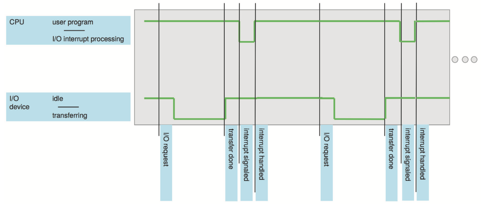

# Operating Systems

## What is an Operating System
An operating system is a program that acts as an intermediary between a user of
a computer and the computer hardware. It's acts as a resource allocator managing 
all resources and decides between conflicting requests for efficient and fair 
resource use. An OS also controls the execution of programs to prevent errors 
and improper use of the computer.

The operating system is responsible for:
- Executing programs
- Make solving user problems easier
- Make the computer system convenient to use
- Use the computer hardware in an efficient manner

## Computer System Structure
Computer systems can be divided into four main components
1. **Hardware**: These items provide basic computing resources, i.e. CPU, memory, 
I/O devices.
2. **Operating system**: Controls and coordinates the use of hardware among 
various applications and users.
3. **Application programs**: These items define the ways in which the system
resources are used to solve the computing problems of the use, i.e. word processors,
compilers, web browsers, database systems, video games.
4. **Users**: People, machines, or other computers.

## Computer Startup
A bootstrap program is loaded at power-up or reboot. This program is typically
stored in ROM or EPROM and is generally know as firmware. This bootstrap program
is responsible for initialising all aspects of the system, loading the operating
system kernel, and starting execution.

## Computer System Organisation
- I/O devices and the CPU can execute concurrently.
- Each device controller is in charge of a particular device type and has a local
buffer.
- The CPU moves data from/to the main memory to/from local buffers.
- I/O is from the device to the local buffer of a particular controller.
- The device controller informs the CPU that it has finished its operation by
causing an interrupt.

## Common Functions of Interrupts
Operating systems are interrupt driven. Interrupts transfer control to the 
interrupt service routine. This generally happens through the interrupt vector 
which contains the addresses of all the service routines. The interrupt architecture 
must save the address of the interrupted instruction.

A trap or exception is a software-generated interrupt caused by either an error
or a user request.

## Interrupt Handling
The operating systems preserves the state of the CPU by storing registers and the
program counter. It then determines which type of interrupt occured, polling or 
vectored interrupt system.

Once determined what caused the interrupt, separate segments of code determine
what action should be taken for each type of interrupt.

  
**Figure: Interrupt timeline for a single program doing output.**

## I/O Structure
There are two ways I/O is usually structured:
1. After I/O starts, control returns to the user program only upon I/O completion.
    - Wait instructions idle the CPU until the next interrupt.
    - At most, one I/O request is outstanding at a time. This means no simultaneous 
    I/O processing.
1. After I/O starts, control returns to the user program without waiting for I/O 
completion.
    - **System call**: Request to the OS to allow users to wait for I/O completion.
    - A **device-status table** containes entries for each I/O device indicating
    its type, address, and state.
    - The OS indexes into the I/O device table to determine the device status and
    to modify a table entry to include an interrupt.

## Storage Definitions and Notation Review
The basic unit of computer storage is a bit. A bit contains one of two values,
0 and 1. A byte is 8 bits, and on most computers is the smallest convenient chunck
of storage.

- A kilobyte, or KB, is \\(1,024\\) bytes
- A megabyte, or MB, is \\(1,024^2\\) bytes
- A gigabyte, or GB, is \\(1,024^3\\) bytes
- A terabyte, or TB, is \\(1,024^4\\) bytes
- A petabyte, or PB, is \\(1,024^5\\) bytes

## Direct Memory Access Structure
This method is used for high-speed I/O devices able to transmit information at
close to memory speeds. Device controllers transfer blocks of data from buffer
storage directly to main memory without CPU intervention. This means only one
interrupt is generated per block rather than the one interrupt per byte.

## Storage Structure
- **Main memory**: Only large storage media that the CPU can access directly.
    - Random access
    - Typically volatile
- **Secondary storage**: An extension of main memory that provides large non-volatile
storage capacity.
- **Magnetic discs**: Rigid metal or glass platters covered with magnetic recording
material. The disk surface is logically divided into tracks which are sub-diveded
into sectors. The disk controller determines the logical interaction between the
device and the computer.
- **Solid-state disks**: Achieves faster speeds than magnetic disks and non-volatile
storage capacity through various technologies.

## Storage Hierarchy
Storages systems are organised into a hierarchy:
- Speeds
- Cost
- Volatility.

There is a device driver for each device controller used to manage I/O. They provide
uniform interfaces between controllers and the kernel.

## Caching
Caching allows information to be copied into a faster storage system. The main memory
can be viewed as a cache for the secondary storage.

Faster storage (cache) is checked first to determine if the information is there:
- If so, information is used directly from the cache
- If not, data is copied to the cache and used there

The cache is usually smaller and more expensive that the storage being cached. 
This means cache management is an important design problem.

## Computer-System Architecture
Most systems use a single general-purpose processor. However, most systems have
special-purpose processors as well.

Multi-processor systems, also known as parallel systems or tightly-coupled systems, 
usually come in two types; Asymmetric Multi-processing or Symmetric Multi-processor.
Multi-processor systems have a few advantages over a single general-purpose processor:
- Increase throughput
- Economy of scale
- Increased reliability, i.e. graceful degradation or fault tolerance

## Clustered Systems
Clustered systems are like Multi-processor systems, they have multiple systems
working together.
- These systems typically share storage via a storage-area network (SAN).
- Provide a high-availability service which survices failures:
    - Asymmetric clustering have one machine in hot-standby mode.
    - Symmetric clustering have multiple nodes running applications, monitoring 
    each other.
- Some clusters are for high-performance computing (HPC). Applications running on 
these clusters must be written to use parallelisation.
- Some have a distributed lock manager (DLM) to avoid conflicting operations.

## Operating System Structure
Multi-programming organises jobs (code and data) so the CPU always has one to 
execute. This is needed for efficiency as a single user cannot keep a CPU and I/O
devices busy at all times. Multi-programming works by keeping a subset of total
jobs in the system, in memory. One job is selected and run via job scheduling.
When it has to wait (for I/O for example), the OS will switch to another job.

Timesharing is a logical extension in which the CPU switches jobs so frequently
that users can interact with each job while it is running.
- The response time should be less than one second.
- Each user has at least one program executing in memory (process).
- If processes don't fit in memory, swapping moves them in and out to run.
- Virtual memory allows execution of processes not completely in memory.
- If several jobs are ready to run at the same time, the CPU scheduler handles 
which to run.

## Operating-System Operations
Dual-mode operations (user mode and kernel mode) allow the OS to protect itself 
and other system components. A mode bit provided by the hardware provides the ability
to distinguish when a system is running user code or kernel code. Some instructions 
are designated as privileged and are only executable in kernel mode. System calls
are used to change the mode to kernel, a return from call resets the mode back to 
user.

Most CPUs also support multi-mode operations, i.e. virtual machine manages (VMM)
mode for guest VMs.
