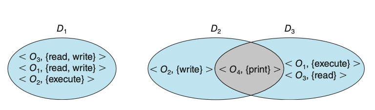
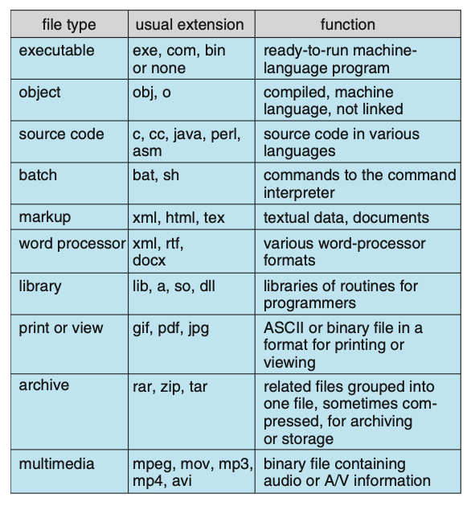
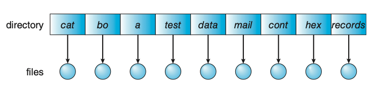
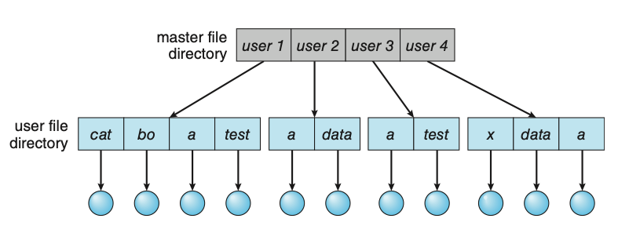
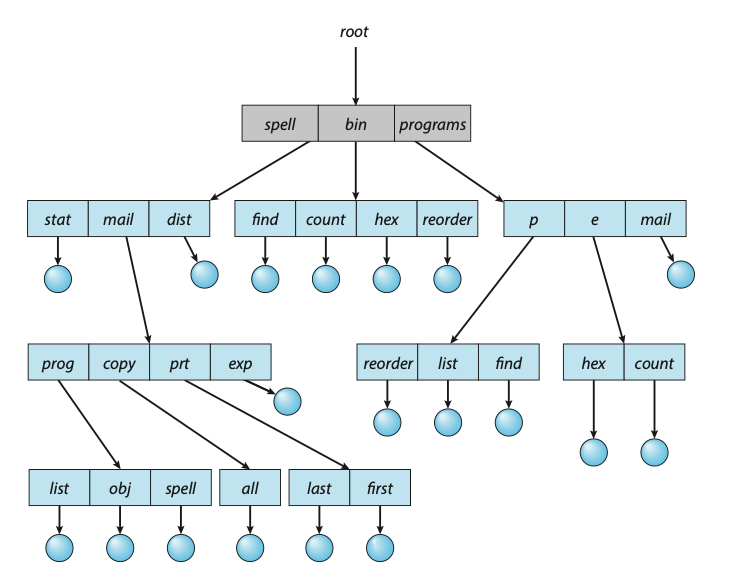
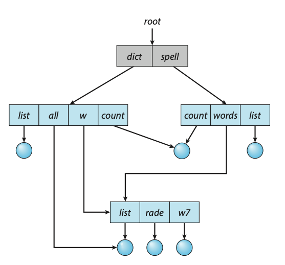

# Protection
The role of protection in a computer system is to provide a mechanism for the 
enforcement of the policies governing resource use. These policies can be established 
in a variety of ways. Some are fixed in the design of the system, while others 
are formulated by the management of a system. Still others are defined by individual 
users to protect resources they “own.” A protection system, then, must have the 
flexibility to enforce a variety of policies.

Policies for resource use may vary by application, and they may change over time. 
For these reasons, protection is no longer the concern solely of the designer of 
an operating system. The application programmer needs to use protection mechanisms 
as well, to guard resources created and supported by an application subsystem 
against misuse.

Frequently, a guiding principle can be used throughout a project, such as the 
design of an operating system. Following this principle simplifies design decisions 
and keeps the system consistent and easy to understand. A key, timetested guiding 
principle for protection is the principle of least privilege. This principle 
dictates that programs, users, and even systems be given just enough privileges 
to perform their tasks.

Observing the principle of least privilege would give the system a chance to mitigate 
the attack — if malicious code cannot obtain root privileges, there is a chance 
that adequately defined permissions may block all, or at least some, of the damaging 
operations. In this sense, permissions can act like an immune system at the 
operating-system level.

Another important principle, often seen as a derivative of the principle of least 
privilege, is compartmentalization. Compartmentalization is the process of protecting 
each individual system compo- nent through the use of specific permissions and 
access restrictions. Then, if a component is subverted, another line of defense 
will “kick in” and keep the attacker from compromising the system any further.

## Domain of Protection
Rings of protection separate functions into domains and order them hierarchically.
A process should be allowed to access only those objects for which it has authorization. 
Furthermore, at any time, a process should be able to access only those objects 
that it currently requires to complete its task. This second requirement, the 
need-to-know principle, is useful in limiting the amount of damage a faulty process 
or an attacker can cause in the system. For example, when process `p` invokes procedure 
`A()`, the procedure should be allowed to access only its own variables and the 
formal parameters passed to it; it should not be able to access all the variables 
of process `p`.

In comparing need-to-know with least privilege, it may be easiest to think of 
need-to-know as the policy and least privilege as the mechanism for achieving 
this policy. For example, in file permissions, need-to-know might dictate that 
a user have read access but not write or execute access to a file. The principle 
of least privilege would require that the operating system provide a mechanism 
to allow read but not write or execute access.

To facilitate the sort of scheme just described, a process may operate within a 
protection domain, which specifies the resources that the process may access. 
Each domain defines a set of objects and the types of operations that may be 
invoked on each object. The ability to execute an operation on an object is an 
access right.

A domain is a collection of access rights, each of which is an ordered pair
`<object-name, rights-set>`. For example, if domain \\(D\\) has the access right 
`<file F, {read,write}>`, then a process executing in domain \\(D\\) can both 
read and write file \\(F\\). It cannot, however, perform any other operation on 
that object.

  
**Figure: System with three protection domains.**

## Access Matrix
The general model of protection can be viewed abstractly as a matrix, called an 
access matrix. The rows of the access matrix represent domains, and the columns 
represent objects. Each entry in the matrix consists of a set of access rights. 
Because the column defines objects explicitly, we can omit the object name from 
the access right. The entry `access(i,j)` defines the set of operations that a 
process executing in domain \\(D_i\\) can invoke on object \\(O_j\\).

  
**Figure: Access matrix.**

When we switch a process from one domain to another, we are executing an operation 
(switch) on an object (the domain). Processes should be able to switch from one 
domain to another. Switching from domain \\(D_i\\) to domain \\(D_j\\) is allowed 
if and only if the access right \\(\text{switch} \in \text{access}(i, j)\\).
Allowing controlled change in the contents of the access-matrix entries requires 
three additional operations: copy, owner, and control. We examine these operations 
next. The ability to copy an access right from one domain (or row) of the access 
matrix to another is denoted by an asterisk (*) appended to the access right. 
The copy right allows the access right to be copied only within the column (that 
is, for the object) for which the right is defined.

The problem of guaranteeing that no information initially held in an object can 
migrate outside of its execution environment is called the confinemen problem. 
This problem is in general unsolvable.

# File Systems
Computers can store information on various storage media, such as NVM devices, 
HDDs, magnetic tapes, and optical disks. So that the computer system will be 
convenient to use, the operating system provides a uniform logical view of stored 
information. The operating system abstracts from the physical properties of its 
storage devices to define a logical storage unit, the file. Files are mapped by 
the operating system onto physical devices. These storage devices are usually 
nonvolatile, so the contents are persistent between system reboots.

A file is a named collection of related information that is recorded on secondary 
storage. From a user’s perspective, a file is the smallest allotment of logical 
secondary storage; that is, data cannot be written to secondary storage unless 
they are within a file. Commonly, files represent programs (both source and object 
forms) and data. Data files may be numeric, alphabetic, alphanumeric, or binary. 
Files may be free form, such as text files, or may be formatted rigidly. In general, 
a file is a sequence of bits, bytes, lines, or records, the meaning of which is 
defined by the file’s creator and user.

## File Attributes
A file is named, for the convenience of its human users, and is referred to by 
its name. A name is usually a string of characters, such as `example.c`. Some 
systems differentiate between uppercase and lowercase characters in names, whereas 
other systems do not. When a file is named, it becomes independent of the process, 
the user, and even the system that created it. For instance, one user might create 
the file `example.c`, and another user might edit that file by specifying its name. 
The file’s owner might write the file to a USB drive, send it as an e-mail attachment, 
or copy it across a network, and it could still be called `example.c` on the 
destination system. Unless there is a sharing and synchonization method, that 
second copy is now independent of the first and can be changed separately.

A file’s attributes vary from one operating system to another but typically consist 
of these:
- **Name**: The symbolic file name is the only information kept in humanreadable 
form.
- **Identifier**: This unique tag, usually a number, identifies the file within 
the file system; it is the non-human-readable name for the file.
- **Type**: This information is needed for systems that support different types 
of files.
- **Location**: This information is a pointer to a device and to the location 
of the file on that device.
- **Size**: The current size of the file (in bytes, words, or blocks) and possibly
the maximum allowed size are included in this attribute.
- **Protection**: Access-control information determines who can do reading, writing, 
executing, and so on.
- **Timestamps and user identification**: This information may be kept for creation, 
last modification, and last use. These data can be useful for protection, security, 
and usage monitoring.

The information about all files is kept in the directory structure, which resides 
on the same device as the files themselves.

## File Operations
A file is an abstract data type. To define a file properly, we need to consider 
the operations that can be performed on files. The operating system can provide 
system calls to create, write, read, reposition, delete, and truncate files.
- **Creating a file**: Two steps are necessary to create a file. First, space in 
the file system must be found for the file. Second, an entry for the new file 
must be made in a directory.
- **Opening a file**: Rather than have all file operations specify a file name, 
causing the operating system to evaluate the name, check access permissions, 
and so on, all operations except create and delete require a file open() first. 
If successful, the open call returns a file handle that is used as an argument 
in the other calls.
- **Writing a file**: To write a file, we make a system call specifying both the 
open file handle and the information to be written to the file. The system must 
keep a write pointer to the location in the file where the next write is to take 
place if it is sequential. The write pointer must be updated whenever a write 
occurs.
- **Reading a file**: To read from a file, we use a system call that specifies 
the file handle and where (in memory) the next block of the file should be put. 
Again, the system needs to keep a read pointer to the location in the file where 
the next read is to take place, if sequential. Once the read has taken place, 
the read pointer is updated. Because a process is usually either reading from 
or writing to a file, the current operation location can be kept as a per-process 
current-file-positio pointer. Both the read and write operations use this same 
pointer, saving space and reducing system complexity.
- **Repositioning within a file**: The current-file-position pointer of the open 
file is repositioned to a given value. Repositioning within a file need not involve 
any actual I/O. This file operation is also known as a file seek.
- **Deleting a file**: To delete a file, we search the directory for the named 
file. Having found the associated directory entry, we release all file space, 
so that it can be reused by other files, and erase or mark as free the directory 
entry. Note that some systems allow hard links—multiple names (directory entries) 
for the same file. In this case the actual file contents is not deleted until 
the last link is deleted.
- **Truncating a file**: The user may want to erase the contents of a file but 
keep its attributes. Rather than forcing the user to delete the file and then 
recreate it, this function allows all attributes to remain unchanged — except 
for file length. The file can then be reset to length zero, and its file space 
can be released.

Most of the file operations mentioned involve searching the directory for the 
entry associated with the named file. To avoid this constant searching, many 
systems require that an `open()` system call be made before a file is first used.
The operating system keeps a table, called the open-file table, containing information 
about all open files. When a file operation is requested, the file is specified 
via an index into this table, so no searching is required. When the file is no 
longer being actively used, it is closed by the process, and the operating system 
removes its entry from the open-file table, potentially releasing locks. 
`create()` and `delete()` are system calls that work with closed rather than open 
files.

Typically, the open-file table also has an open count associated with each file 
to indicate how many processes have the file open. Each `close()` decreases this 
open count, and when the open count reaches zero, the file is no longer in use, 
and the file’s entry is removed from the open-file table.

Some operating systems provide facilities for locking an open file (or sections 
of a file). File locks allow one process to lock a file and prevent other processes 
from gaining access to it. File locks are useful for files that are shared by 
several processes - for example, a system log file that can be accessed and modified 
by a number of processes in the system. File locks provide functionality similar 
to reader–writer locks. A shared lock is akin to a reader lock in that several 
processes can acquire the lock concurrently. An exclusive lock behaves like a 
writer lock; only one process at a time can acquire such a lock.

Furthermore, operating systems may provide either mandatory or advisory file-locking
mechanisms. With mandatory locking, once a process acquires an exclusive lock, 
the operating system will prevent any other process from accessing the locked file.
For example, assume a process acquires an exclusive lock on the file `system.log`. 
If we attempt to open `system.log` from another process — for example, a text editor — 
the operating system will prevent access until the exclusive lock is released. 
Alternatively, if the lock is advisory, then the operating system will not prevent 
the text editor from acquiring access to `system.log`. Rather, the text editor 
must be written so that it manually acquires the lock before accessing the file. 
In other words, if the locking scheme is mandatory, the operating system ensures 
locking integrity. For advisory locking, it is up to software developers to ensure 
that locks are appropriately acquired and released.

  
**Figure: Common file types.**

## File Structure
Some operating systems impose (and support) a minimal number of file structures. 
This approach has been adopted in UNIX, Windows, and others. UNIX considers each 
file to be a sequence of 8-bit bytes; no interpretation of these bits is made by 
the operating system. This scheme provides maximum flexibility but little support. 
Each application program must include its own code to interpret an input file as 
to the appropriate structure. However, all operating systems must support at 
least one structure—that of an executable file—so that the system is able to 
load and run programs.

File types also can be used to indicate the internal structure of the file. Source 
and object files have structures that match the expectations of the programs that 
read them. Further, certain files must conform to a required structure that is 
understood by the operating system. For example, the operating system requires 
that an executable file have a specific structure so that it can determine where 
in memory to load the file and what the location of the first instruction is. 
Some operating systems extend this idea into a set of system-supported file structures, 
with sets of special operations for manipulating files with those structures.

## Access Methods
Files store information. When it is used, this information must be accessed and 
read into computer memory. The information in the file can be accessed in several 
ways. Some systems provide only one access method for files. Others (such as 
mainframe operating systems) support many access methods, and choosing the right 
one for a particular application is a major design problem.

The simplest access method is sequential access. Information in the file is processed 
in order, one record after the other. This mode of access is by far the most common; 
for example, editors and compilers usually access files in this fashion. Reads 
and writes make up the bulk of the operations on a file. A read operation — `read_next()` 
— reads the next portion of the file and automatically advances a file pointer, 
which tracks the I/O location. Similarly, the write operation— `write_next()` —
appends to the end of the file and advances to the end of the newly written 
material (the new end of file). Such a file can be reset to the beginning, and 
on some systems, a program may be able to skip forward or backward \\(n\\) records 
for some integer \\(n\\) — perhaps only for \\(n = 1\\)).

Another method is direct access (or relative access). Here, a file is made up 
of fixed-length logical records that allow programs to read and write records 
rapidly in no particular order. The direct-access method is based on a disk 
model of a file, since disks allow random access to any file block. For direct 
access, the file is viewed as a numbered sequence of blocks or records. Thus,
we may read block 14, then read block 53, and then write block 7. There are no 
restrictions on the order of reading or writing for a direct-access file.
Direct-access files are of great use for immediate access to large amounts of 
information. Databases are often of this type. When a query concerning a particular 
subject arrives, we compute which block contains the answer and then read that 
block directly to provide the desired information.

For the direct-access method, the file operations must be modified to include 
the block number as a parameter. Thus, we have `read(n)`, where `n` is the block 
number, rather than read `next()`, and `write(n)` rather than write `next()`. 
An alternative approach is to retain read `next()` and write `next()` and to add 
an operation position `file(n)` where `n` is the block number. Then, to effect 
a `read(n)`, we would position `file(n)` and then read `next()`.

The block number provided by the user to the operating system is normally a 
relative block number. A relative block number is an index relative to the beginning 
of the file. Thus, the first relative block of the file is 0, the next is 1, 
and so on, even though the absolute disk address may be 14703 for the first block 
and 3192 for the second. The use of relative block numbers allows the operating 
system to decide where the file should be placed (called the allocation problem) 
and helps to prevent the user from accessing portions of the file system that
may not be part of her file.

## Other Access Methods
Other access methods can be built on top of a direct-access method. These methods 
generally involve the construction of an index for the file. The index, like an 
index in the back of a book, contains pointers to the various blocks. To find a 
record in the file, we first search the index and then use the pointer to access 
the file directly and to find the desired record.

With large files, the index file itself may become too large to be kept in memory.
One solution is to create an index for the index file. The primary index file 
contains pointers to secondary index files, which point to the actual data items.

## Types of File Systems
Computer systems may also have varying numbers of file systems, and the file 
systems may be of varying types. Consider the types of file systems in Solaris:
- **tmpfs**: A “temporary” file system that is created in volatile main memory
and has its contents erased if the system reboots or crashes
- **objfs**: A “virtual” file system (essentially an interface to the kernel that 
looks like a file system) that gives debuggers access to kernel symbols.
- **ctfs**: A virtual file system that maintains “contract” information to manage 
which processes start when the system boots and must continue to run during operation.
- **lofs**: A “loop back” file system that allows one file system to be accessed 
in place of another one.
- **procfs**: A virtual file system that presents information on all processes 
as a file system.
- **ufs, zfs**: A general-purpose file systems.

## Directory Structure
The directory can be viewed as a symbol table that translates file names into 
their file control blocks. If we take such a view, we see that the directory 
itself can be organized in many ways. The organization must allow us to insert 
entries, to delete entries, to search for a named entry, and to list all the 
entries in the directory.

When considering a particular directory structure, we need to keep in mind the 
operations that are to be performed on a directory:
- **Search for a file**: We need to be able to search a directory structure to
find the entry for a particular file. Since files have symbolic names, and similar
names may indicate a relationship among files, we may want to be able to
find all files whose names match a particular pattern.
- **Create a file**: New files need to be created and added to the directory.
- **Delete a file**: When a file is no longer needed, we want to be able to remove 
it from the directory. Note a delete leaves a hole in the directory structure 
and the file system may have a method to defragement the directory structure.
- **List a directory**: We need to be able to list the files in a directory and 
the contents of the directory entry for each file in the list.
- **Rename a file**: Because the name of a file represents its contents to its 
users, we must be able to change the name when the contents or use of the file 
changes. Renaming a file may also allow its position within the directory structure 
to be changed.
- **Traverse the file system**: We may wish to access every directory and every 
file within a directory structure. For reliability, it is a good idea to save 
the contents and structure of the entire file system at regular intervals. 
Often, we do this by copying all files to magnetic tape, other secondary storage, 
or across a network to another system or the cloud. This technique provides a 
backup copy in case of system failure. In addition, if a file is no longer in use, 
the file can be copied the backup target and the disk space of that file released 
for reuse by another file.

## Single-Level Directory
The simplest directory structure is the single-level directory. All files are 
contained in the same directory.

- Advantages:
    - Easy to implement.
    - Easy to understand.
- Disadvantages:
    - Since all files are in the same directory, they must have unique names.
    - Relevant files cannot be grouped together.

  
**Figure: Single-level directory.**

## Two-Level Directory
In the two-level directory structure, each user has his own user file directory 
(UFD). The UFDs have similar structures, but each lists only the files of a single 
user. When a user refers to a particular file, only his own UFD is searched. 
Thus, different users may have files with the same name, as long as all the file 
names within each UFD are unique.

  
**Figure: Two-level directory structure.**

## Tree-Structured Directories
Once we have seen how to view a two-level directory as a two-level tree, the 
natural generalization is to extend the directory structure to a tree of arbitrary 
height. This generalization allows users to create their own subdirectories and 
to organize their files accordingly. A tree is the most common directory structure. 
The tree has a root directory, and every file in the system has a unique path name.
A directory (or subdirectory) contains a set of files or subdirectories. In many 
implementations, a directory is simply another file, but it is treated in a special 
way. All directories have the same internal format. One bit in each directory 
entry defines the entry as a file (0) or as a subdirectory (1).

Path names can be of two types: absolute and relative. In UNIX and Linux, an 
absolute path name begins at the root (which is designated by an initial “/”) 
and follows a path down to the specified file, giving the directory names on the 
path. A relative path name defines a path from the current directory. For example 
if the current directory is `/spell/mail`, then the relative path name `prt/first` 
refers to the same file as does the absolute path name `/spell/mail/prt/first`.

  
**Figure: Tree-structured directory structure.**

## Acyclic-Graph Directories
Consider two programmers who are working on a joint project. The files associated 
with that project can be stored in a subdirectory, separating them from other 
projects and files of the two programmers. But since both programmers are equally 
responsible for the project, both want the subdirectory to be in their own directories. 
In this situation, the common subdirectory should be shared. A shared directory 
or file exists in the file system in two (or more) places at once.

A tree structure prohibits the sharing of files or directories. An acyclic graph
— that is, a graph with no cycles — allows directories to share subdirectories 
and files. The same file or subdirectory may be in two different directories. 
The acyclic graph is a natural generalization of the tree-structured directory 
scheme.

Shared files and subdirectories can be implemented in several ways. A common way, 
exemplified by UNIX systems, is to create a new directory entry called a link. 
A link is effectively a pointer to another file or subdirectory. For example, a 
link may be implemented as an absolute or a relative path name. When a reference 
to a file is made, we search the directory. If the directory entry is marked as 
a link, then the name of the real file is included in the link information. We 
resolve the link by using that path name to locate the real file. Links are easily 
identified by their format in the directory entry (or by having a special type 
on systems that support types) and are effectively indirect pointers. The operating 
system ignores these links when traversing directory trees to preserve the acyclic 
structure of the system.

  
**Figure: Acyclic-graph directory structure.**

## File System Mounting
Just as a file must be opened before it can be used, a file system must be mounted
before it can be available to processes on the system. More specifically, the 
directory structure may be built out of multiple file-system-containing volumes, 
which must be mounted to make them available within the file- system name space.

The mount procedure is straightforward. The operating system is given the name 
of the device and the mount point — the location within the file structure where 
the file system is to be attached. Some operating systems require that a file-system 
type be provided, while others inspect the structures of the device and determine 
the type of file system. Typically, a mount point is an empty directory.

## Disk Structure
- Disk can be subdivided into partitions. Disks or partitions can be RAID 
(Redundant Array of Independent Disks) protected against failure.
- Disk or partition can be used raw – without a file system, or formatted
with a file system.
- A disk can be sliced into multiple partitions, or a volume can span multiple 
partitions on multiple disks.
- An entity containing a file system known as a volume. Each volume containing 
file system also tracks that file system’s info in a device directory or volume 
table of contents.
- As well as general-purpose file systems there are many special-purpose file systems, 
frequently all within the same operating system or computer.
