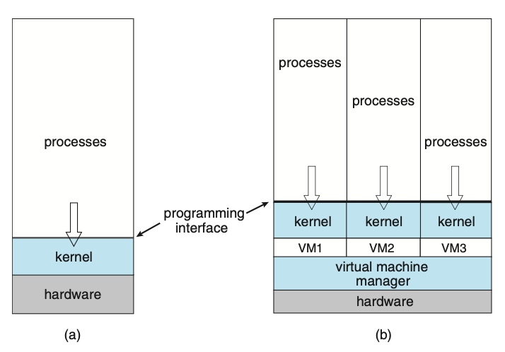
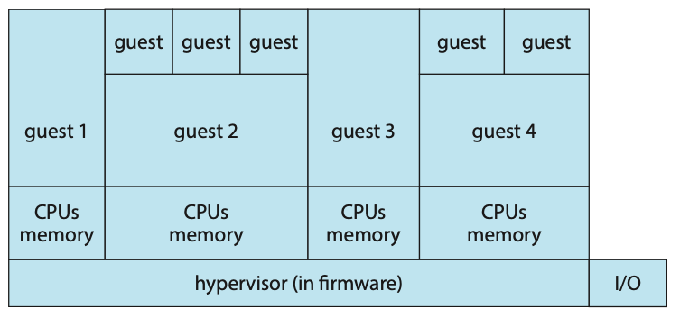
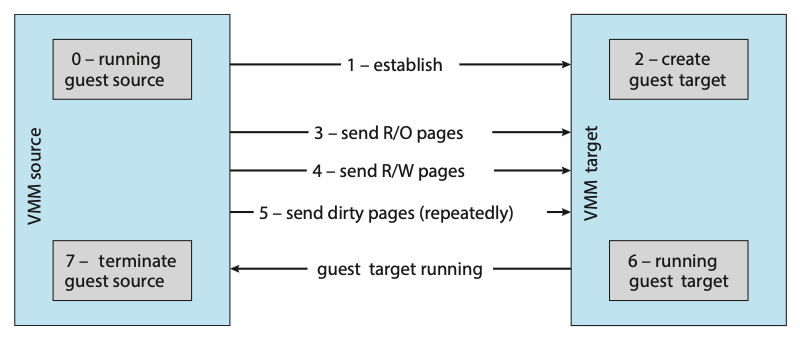

# Virtual Machines
The fundamental idea behind a virtual machine is to abstract the hardware of a 
single computer (the CPU, memory, disk drives, network interface cards, and so 
forth) into several different execution environments, thereby creating the illusion 
that each separate environment is running on its own private computer. This concept 
may seem similar to the layered approach of operating system implementation, 
and in some ways it is. In the case of virtualization, there is a layer that 
creates a virtual system on which operating systems or applications can run.

Virtual machine implementations involve several components. At the base is the 
host, the underlying hardware system that runs the virtual machines. The virtual 
machine manager (VMM) (also known as a hypervisor) creates and runs virtual 
machines by providing an interface that is identical to the host (except in the 
case of paravirtualization). Each guest process is provided with a virtual copy
of the host. Usually, the guest process is in fact an operating system. A single 
physical machine can thus run multiple operating systems concurrently, each in 
its own virtual machine.

  
**Figure: System models. (a) Nonvirtual machine. (b) Virtual machine.**

## Types of Hypervisors
The implementation of VMMs varies greatly. Options include the following:
- Hardware-based solutions that provide support for virtual machine creation and 
management via firmware. These VMMs, which are commonly found in mainframe and 
large to midsized servers, are generally known as type 0 hypervisors. IBM LPARs 
and Oracle LDOMs are examples.
- Operating-system-like software built to provide virtualization, including VMware 
ESX (mentioned above), Joyent SmartOS, and Citrix XenServer. These VMMs are 
known as type 1 hypervisors.
- Applications that run on standard operating systems but provide VMM features 
to guest operating systems. These applications, which include VMware Workstation 
and Fusion, Parallels Desktop, and Oracle Virtual- Box, are type 2 hypervisors.

## Benefits and Features
Several advantages make virtualization attractive. Most of them are fundamentally 
related to the ability to share the same hardware yet run several different 
execution environments (that is, different operating systems) concurrently.

One important advantage of virtualization is that the host system is protected 
from the virtual machines, just as the virtual machines are protected from each 
other. A virus inside a guest operating system might damage that operating system 
but is unlikely to affect the host or the other guests. Because each virtual 
machine is almost completely isolated from all other virtual machines, there 
are almost no protection problems.

One feature common to most virtualization implementations is the ability to freeze, 
or suspend, a running virtual machine. Many operating systems provide that basic 
feature for processes, but VMMs go one step further and allow copies and snapshots 
to be made of the guest. The copy can be used to create a new VM or to move a 
VM from one machine to another with its current state intact. The guest can then 
resume where it was, as if on its original machine, creating a clone. The snapshot 
records a point in time, and the guest can be reset to that point if necessary 
(for example, if a change was made but is no longer wanted).

A virtual machine system is a perfect vehicle for operating-system research and 
development. Normally, changing an operating system is a difficult task. Operating 
systems are large and complex programs, and a change in one part may cause obscure 
bugs to appear in some other part. The power of the operating system makes changing 
it particularly dangerous. Because the operating system executes in kernel mode, 
a wrong change in a pointer could cause an error that would destroy the entire 
file system. Thus, it is necessary to test all changes to the operating system 
carefully.

Another advantage of virtual machines for developers is that multiple operating 
systems can run concurrently on the developer’s workstation. This virtualized 
workstation allows for rapid porting and testing of programs in varying environments. 
In addition, multiple versions of a program can run, each in its own isolated 
operating system, within one system. Similarly, quality assurance engineers can 
test their applications in multiple environments without buying, powering, 
and maintaining a computer for each environment.

A major advantage of virtual machines in production data-center use is system 
consolidation, which involves taking two or more separate systems and running 
them in virtual machines on one system. Such physical-to-virtual conversions 
result in resource optimization, since many lightly used systems can be combined 
to create one more heavily used system.

Consider, too, that management tools that are part of the VMM allow system administrators 
to manage many more systems than they otherwise could. A virtual environment 
might include 100 physical servers, each running 20 virtual servers. Without 
virtualization, 2,000 servers would require several system administrators. With 
virtualization and its tools, the same work can be managed by one or two administrators. 
One of the tools that make this possible is templating, in which one standard virtual 
machine image, including an installed and configured guest operating system and 
applications, is saved and used as a source for multiple running VMs. Other 
features include managing the patching of all guests, backing up and restoring 
the guests, and monitoring their resource use.

Virtualization can improve not only resource utilization but also resource management.
Some VMMs include a live migration feature that moves a run- ning guest from
one physical server to another without interrupting its opera- tion or active 
network connections. If a server is overloaded, live migration can thus free 
resources on the source host while not disrupting the guest. Similarly, when 
host hardware must be repaired or upgraded, guests can be migrated to other servers, 
the evacuated host can be maintained, and then the guests can be migrated back. 
This operation occurs without downtime and without interruption to users.

## Types of VMs
Whatever the hypervisor type, at the time a virtual machine is created, its creator 
gives the VMM certain parameters. These parameters usually include the number of
CPUs, amount of memory, networking details, and storage details that the VMM will 
take into account when creating the guest. For example, a user might want to 
create a new guest with two virtual CPUs, 4 GB of memory, 10 GB of disk space, 
one network interface that gets its IP address via DHCP, and access to the DVD 
drive.

The VMM then creates the virtual machine with those parameters. In the case of 
a type 0 hypervisor, the resources are usually dedicated. In this situation, if 
there are not two virtual CPUs available and unallocated, the creation request 
in our example will fail. For other hypervisor types, the resources are dedicated 
or virtualized, depending on the type. Certainly, an IP address cannot be shared,
but the virtual CPUs are usually multiplexed on the physical CPUs. Similarly, 
memory management usually involves allocating more memory to guests than actually 
exists in physical memory. Finally, when the virtual machine is no longer needed, 
it can be deleted. When this happens, the VMM first frees up any used disk space 
and then removes the configuration associated with the virtual machine, essentially 
forgetting the virtual machine.

This ease of creation can lead to virtual machine sprawl, which occurs when there 
are so many virtual machines on a system that their use, history, and state become 
confusing and difficult to track.

### Type 0 Hypervisor
Type 0 hypervisors have existed for many years under many names, including “partitions” 
and “domains.” They are a hardware feature, and that brings its own positives 
and negatives. Operating systems need do nothing special to take advantage of 
their features. The VMM itself is encoded in the firmware and loaded at boot time. 
In turn, it loads the guest images to run in each partition. The feature set of 
a type 0 hypervisor tends to be smaller than those of the other types because 
it is implemented in hardware. For example, a system might be split into four 
virtual systems, each with dedicated CPUs, memory, and I/O devices. Each guest 
believes that it has dedicated hardware because it does, simplifying many implementation 
details.

I/O presents some difficulty, because it is not easy to dedicate I/O devices to 
guests if there are not enough. What if a system has two Ethernet ports and more 
than two guests, for example? Either all guests must get their own I/O devices, 
or the system must provided I/O device sharing. In these cases, the hypervisor 
manages shared access or grants all devices to a control partition. In the control 
partition, a guest operating system provides services (such as networking) via 
daemons to other guests, and the hypervisor routes I/O requests appropriately. 
Some type 0 hypervisors are even more sophisticated and can move physical CPUs 
and memory between running guests. In these cases, the guests are paravirtualized, 
aware of the virtualization and assisting in its execution.

Because type 0 virtualization is very close to raw hardware execution, it should 
be considered separately from the other methods discussed here. A type 0 hypervisor 
can run multiple guest operating systems (one in each hardware partition). All 
of those guests, because they are running on raw hardware, can in turn be VMMs. 
Essentially, each guest operating system in a type 0 hypervisor is a native 
operating system with a subset of hardware made available to it. Because of that, 
each can have its own guest operating systems. Other types of 
hypervisors usually cannot provide this virtualization-within- virtualization 
functionality.

  
**Figure: Type 0 hypervisor.**

### Type 1 Hypervisor

Type 1 hypervisors are commonly found in company data centers and are, in a sense, 
becoming “the data-center operating system.” They are special-purpose operating 
systems that run natively on the hardware, but rather than providing system calls 
and other interfaces for running programs, they create, run, and manage guest
operating systems. In addition to running on standard hard- ware, they can run 
on type 0 hypervisors, but not on other type 1 hypervisors. Whatever the platform, 
guests generally do not know they are running on anything but the native hardware.

Type 1 hypervisors run in kernel mode, taking advantage of hardware protection. 
Where the host CPU allows, they use multiple modes to give guest operating systems 
their own control and improved performance. They implement device drivers for 
the hardware they run on, since no other component could do so. Because they are 
operating systems, they must also provide CPU scheduling, memory management, 
I/O management, protection, and even security.

By using type 1 hypervisors, data-center managers can control and manage the 
operating systems and applications in new and sophisticated ways. An important 
benefit is the ability to consolidate more operating systems and applications 
onto fewer systems. For example, rather than having ten systems running at 10 
percent utilization each, a data center might have one server man- age the entire 
load. If utilization increases, guests and their applications can be moved to 
less-loaded systems live, without interruption of service.

Another type of type 1 hypervisor includes various general-purpose operating 
systems with VMM functionality. Here, an operating system such as RedHat Enterprise 
Linux, Windows, or Oracle Solaris performs its normal duties as well as providing 
a VMM allowing other operating systems to run as guests. Because of their extra 
duties, these hypervisors typically provide fewer virtual- ization features than 
other type 1 hypervisors. In many ways, they treat a guest operating system as 
just another process, but they provide special handling when the guest tries to 
execute special instructions.

### Type 2 Hypervisor
This type of VMM is simply another process run and managed by the host, and even 
the host does not know that virtual- ization is happening within the VMM. Type 
2 hypervisors have limits not associated with some of the other types. For example, 
a user needs administrative privileges to access many of the hardware assistance 
features of modern CPUs. If the VMM is being run by a standard user without 
additional privileges, the VMM cannot take advantage of these features. Due to 
this limitation, as well as the extra overhead of running a general-purpose 
operating system as well as guest operating systems, type 2 hypervisors tend to 
have poorer overall performance than type 0 or type 1.

As is often the case, the limitations of type 2 hypervisors also provide some
benefits. They run on a variety of general-purpose operating systems, and running 
them requires no changes to the host operating system. A student can use a type 
2 hypervisor, for example, to test a non-native operating system without replacing 
the native operating system. In fact, on an Apple laptop, a student could have 
versions of Windows, Linux, Unix, and less common operating systems all available 
for learning and experimentation.

## Live Migration
One feature not found in general-purpose operating systems but found in type 0 
and type 1 hypervisors is the live migration of a running guest from one system 
to another. A running guest on one system is copied to another system running the 
same VMM. The copy occurs with so little interruption of service that users logged 
in to the guest, as well as network connections to the guest, continue without 
noticeable impact. This rather astonishing ability is very powerful in resource 
management and hardware administration.

  
**Figure: Live migration of a guest between two servers.**

## Energy Efficiency
Data centres consume a huge amount of energy resulting in high operational costs 
and carbon dioxide emissions. It's estimated that the energy consumption by data 
centres worldwide comprises about 1.3% of the global energy usage; The energy 
consumption by data centres in Australia is about 1.5% of Australian’s total 
energy consumption.

At this scale, even relatively modest energy efficiency improvements in data centers 
yield significant savings in operational costs and avert millions of tons of carbon
dioxide emissions. Reducing the energy consumption of the IT equipment is more 
important than reducing the energy consumption of the non-IT equipment. When the 
energy consumption of the IT equipment decreases by 1 watt, the energy consumed 
by the non-IT equipment will decrease by 1.7 - 2.3 watts.

The server consolidation problem can be modelled as a Virtual Machine Placement 
(VMP) problem. Given the CPU and memory capacities of the PMs in a data centre, 
the CPU and memory requirements of each of the VMs in the data centre, the physical 
communication topology of the PMs, the VMP is to find a placement of the VMs on 
the PMs such that the total energy consumption of the PMs which are hosting at 
least one VM is minimised, subject to:
- The total CPU requirement of the VMs placed on any PM does not exceed the CPU 
capacity of the PM; and
- The total memory requirement of the VMs placed on any PM does
not exceed the memory capacity of the PM.
