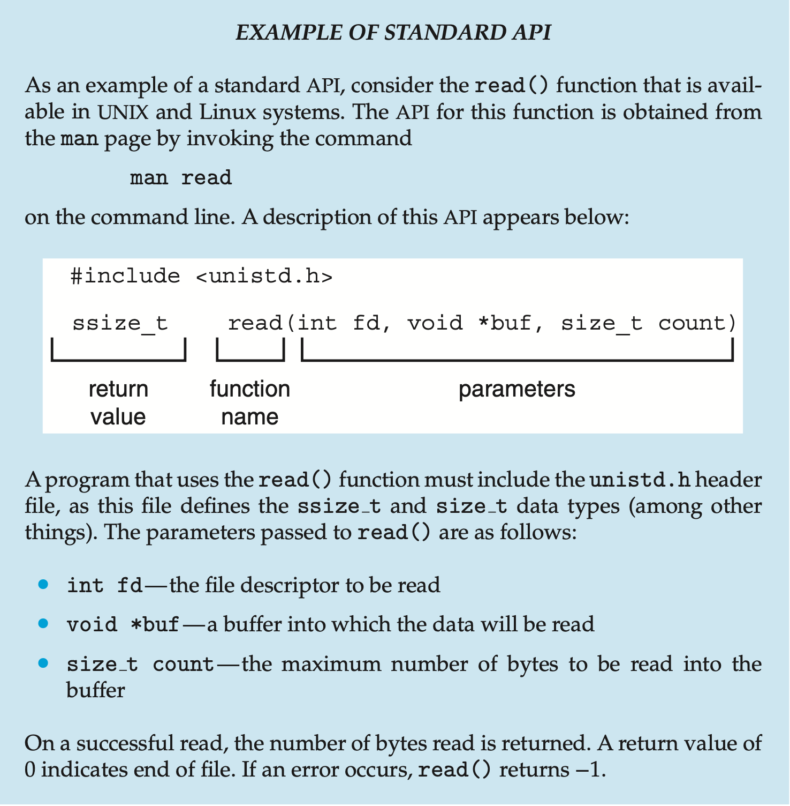
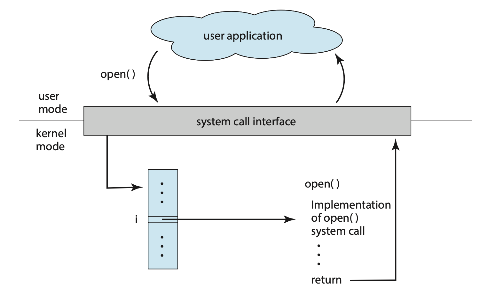
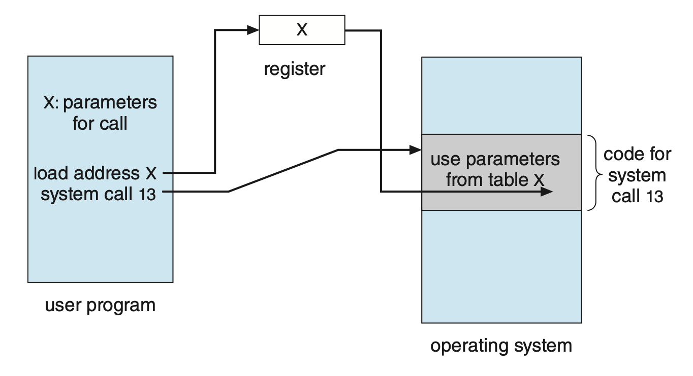
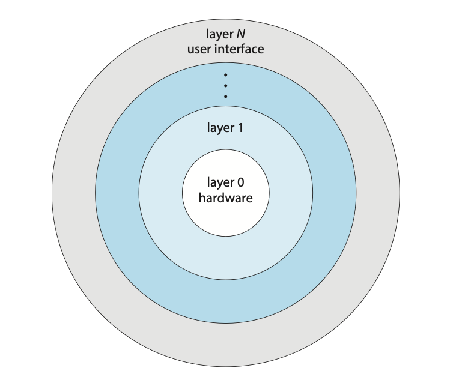
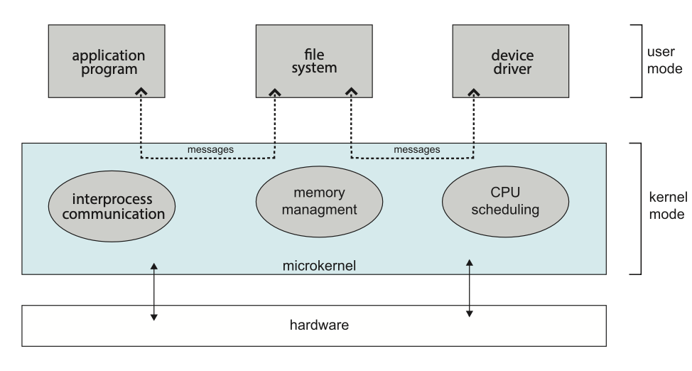

# Operating System Structures

## Operating System Services
Operating systems provide an environment for execution of programs and services
to programs and users.

There are many operating system services that provide functions that are
helpful to the user such as:
- **User interface**: Almost all operating systems have a user interface. This can
be in the form of a graphical user interface (GUI) or a command-line (CLI).
- **Program execution**: The system must be able to load a program into memory
and run that program, end execution, either normally or abnormally.
- **I/O operations**: A running program may require I/O, which may involve a file
or an I/O device.
- **File-system manipulation**: The file system is of particular interest. Programs
need to read and write files and directories, create and delete them, search
them, list file information, manage permissions, and more.
- **Communication**: Processors may exchange information, on the same computer
or between computers over a network.
- **Error detection**: OS needs to be constantly aware of possible errors:
    - May occur in the CPU and memory hardware, in I/O devices, in user programs,
    and more.
    - For each type of error, the OS should take the appropriate action to ensure
    correct and consistent computing.
    - Debugging facilities can greatly enhance the user's and programmer's abilities
    to efficiently use the system.

Another set of OS functions exist for ensuring the efficient operation of the
system itself via resource sharing.
- **Resource allocation**: When multiple users or multiple jobs are running
concurrently, resources must be allocated to each of them.
- **Accounting**: To keep track of which users use how much and what kinds of
resources.
- **Protection and security**: The owners of information stored in a multi-user
or networked computer system may want to control use of that information. Concurrent
processes should not interfere with each other.
    - Protection involves ensuring that all access to system resources is controlled.
    - Security of the system from outsiders requires user authentication. This also
    extends to defending external I/O devices from invalid access attempts.
    - If a system is to be protected and secure, pre-cautions must be instituted
    throughout it. A chain is only as strong as its weakest link.

## System Calls
System calls provide an interface to the services made available by an operating
system. These calls are generally written in higher-level languages such as
C and C++. These system calls however, are mostly accessed by programs via
a high-level application programming interface (API) rather than direct system
call use.

The three most common APIs are Win32 API for Windows, POSIX API for POSIX-based systems,
and JAVA API for the Java virtual machine (JVM)

Typically, a number is associated with each system call. The system-call
interface maintains a table indexed according to these numbers. The system call
interface invokes the intended system call in the OS kernel and returns a status
of the systema call and any return values. The caller needs to know nothing about
how the system call is implemented, it just needs to obey the API and understand
what the OS will do as a result call.

**Figure: The handling of a user application invoking the `open()` system call.**

There are many types of system calls:
- Process control
- File management
- Device management
- Information maintenance
- Communications
- Protection

Often, more information is required than simply the identity of the system call.
There are three general methods used to pass parameters to the OS:
1. Pass parameters into registers. This won't always work however as there may
be more parameters than registers.
2. Store parameters in a block, or table, in memory, and pass the address of 
the block as a parameter in a register.
3. Parameters are placed, or pushed, onto the stack by the program and popped
off the stack by the operating system. This method does not limit the number
length of the parameters being passed.

**Figure: Passing of parameters as a table.**

## System Programs
System programs provide a convenient environment for program development and 
execution. They can be generally divided into:
- File manipulation
- Status information sometimes stored in a file modification
- Programming language support
- Program loading and execution
- Communications
- Background services
- Application programs

## UNIX
UNIX is limited by hardware functionality. The original UNIX operating system
had limited structing. The UNIX OS consists of two separable parts:
1. Systems programs
2. The kernel:
    - Consists of everything below the system-call interface and above the
    physical hardware.
    - Provides the file system, CPU scheduling, memory management, and other
    operating-system functions.

## Operating System Structure
There are a few ways to organise an operating system.

### Layered
The operating system is divided into a number of layers, each built on top
of the lower layers. The bottom layer (layer 0), is the hardware; the highest
is the user interface.

Due to the modularity, layers are selected such that each uses functions and 
services of only lower-level layers.

**Figure: A layered operating system.**

### Microkernel System
In this organisation method, as much as possible is moved from the kernel into 
user space. An example OS that uses a microkernel is Mach, which parts of the
MacOSX kernel (Darwin) is based upon. Communication takes place between user 
modules via message passing.

| Advantages | Disadvantages |
| ---------- | ------------- |
| Easier to extend a microkernel | Performance overhead of user space to kernel space communication |
| Easier to port the operating system to new architectures | |
| More reliable (less code is running in kernel mode) | |
| More secure | |

**Figure: Architecture of a typical microkernel.**

### Hybrid System
Most modern operating systems don't use a single model but a use concepts from
a variety. Hybrid systems combine multiple approaches to address performance, security,
and usability needs.

For example, Linux is monolithic, because having the operating system in a 
single address space provides very efficient performance. However, it's also 
modular, so that new functionality can be dynamically added to the kernel.

## Modules
Most modern operating systems implement loadable kernel modules (LKMs).
Here, the kernel has a set of core components and can link in additional 
services via modules, either at boot time or during run time

Each core component is separate, can talk to others via known interfaces,
and is loadable as needed within the kernel.
