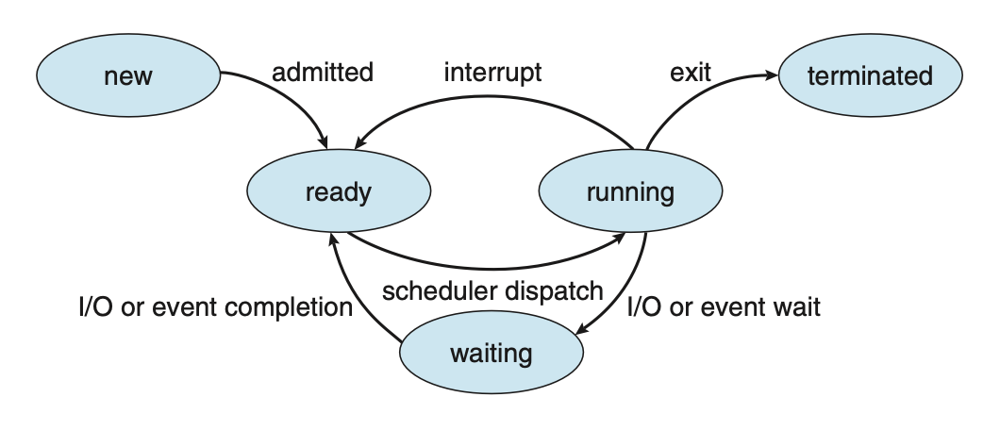
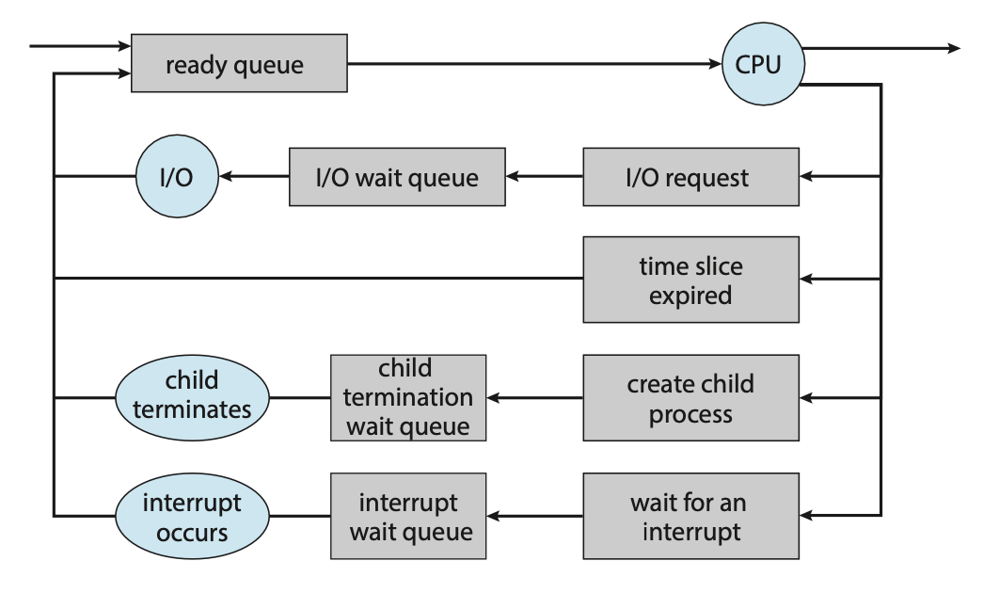
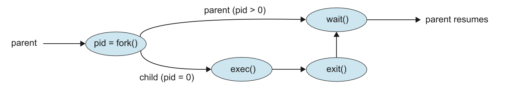
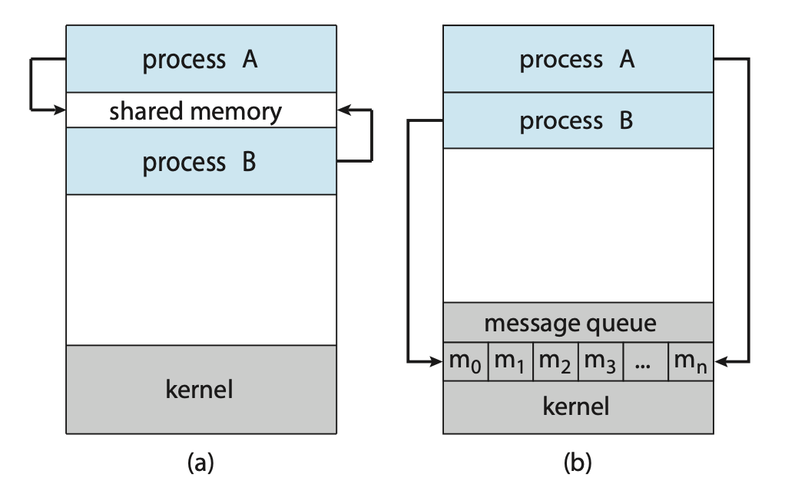

# Processes
An operating system executes a variety of programes either via:
- Batch systems (jobs)
- or Time-shared systems (user programs or tasks)

A process, sometimes referred to as a job, is simply a program in execution.
The status of the current activity of a process is represented by the value 
of the program counter and the contents of the processor’s registers.

A process is made up of multiple parts:
- **Text section**: The executable code
- **Data section**: Global variables
- **Heap section**: Memory that is dynamically allocated during program run
time
- **Stack section**: Temporary data storage when invoking functions 
(such as function parameters, return addresses, and local variables)

It's important to note that a program itself is not a process but rather a 
passive entity. In contrast, a process is an active entity, with a program 
counter specifying the next instruction to execute and a set of associated 
resources.

As a process executes, it changes state. A process may be in one of the following 
states:
- **new**: The process is being created.
- **running**: Instructions are being executed.
- **waiting**: The process is waiting for some event to occur.
- **ready**: The process is waiting to be assigned to a processor.
- **terminated**: The process has finished execution.


**Figure: Diagram of process state.**

## Process Control Block (PCB)
Each process is represented in the OS by a process control block, also known as
a task control block. It contains information associated with a specific process
such as:
- **Process state**: The state of the process.
- **Program counter**: The address of the next instruction to be executed for 
this process.
- **CPU registers**: The contents of all process-centric registers. Along with 
the program counter, this state information must be saved when an interrupt 
occurs, to allow the process to be continued correctly afterward when it is 
rescheduled to run.
- **CPU scheduling information**: Information about process priority, pointers 
to scheduling queues, and any other scheduling parameters.
- **Memory-management information**: This information may include such items 
as the value of the base and limit registers and the page tables, or the 
segment tables, depending on the memory system used by the operating system.
- **Accounting information**: This information includes the amount of CPU and 
real time used, time limits, account numbers, job or process numbers, etc..
- **I/O status information**: This information includes the list of I/O 
devices allocated to the process, a list of open files, etc..

## Threads
In a single-threaded model, only a single thread of instructions can be executed.
This means only a single tasks can be completed at any given time. For example,
in a word document, the user cannot simultaneously type in characters and run 
the spell checker.

In most modern operating systems however, the use of multiple threads allows more
than one task to be performed at any given moment. A multithreaded word 
processor could, for example, assign one thread to manage user input while 
another thread runs the spell checker. 

In a multi-threaded system, the PCB is expanded to include information for 
each thread.

## Process Scheduling
The objective of multi-programming is to have some process running at all times 
so as to maximize CPU utilization. A process scheduler is used to determine which
process should be executed. The number of processes currently in memory is known 
as the degree of multiprogramming

When a process enters the system, it's put into a **ready queue** where it then waits
to be executed. When a process is allocated a CPU core for execution it executes 
for a while and eventually terminates, is interrupted, or waits for the 
occurrence of a particular event. Any process waiting for an event to occur gets
placed into a **wait queue**.


**Figure: Queueing-diagram representation of process scheduling.**

Most processos can be described as either:
- **I/O bound**: A I/O bound process that spends more of its time doing I/O operations.
- **CPU bound**: Spends more of its time doing more calculations with infrequent
I/O requests.

## Context Switch
Interrupts cause the operating system to change a CPU core from its current task
and to run a kernel routine. These operations happen frequently so it's important
to ensure that when returning to the process, no information was lost.

Switching the CPU core to another process requires performing a state save of 
the current process and a state restore of a different process. This task is 
known as a context switch. When a context switch occurs, the kernel saves the 
context of the old process in its PCB and loads the saved context of the new 
process scheduled to run.

The time between a context switch is considered as overhead as no useful work is
done while switching. The more complex the OS and PCB, the longer it takes to
context switch.

## Process Creation
During execution, a process may need to create more processes. The creating 
process is called a parent process, and the new processes are called the 
children of that process. Each of these new processes may in turn create other 
processes, forming a tree of processes. Processes are identified by their process 
identifier (PID).

When a process is created, it will generally require some amount of resources to
accomplish its task. A child process may be able to obtain its resources directly 
from the operating system, or it may be constrained to a subset of the resources 
of the parent process.

When a process creates a new process, two possibilities for execution exist:
1. The parent continues to execute concurrently with its children.
2. The parent waits until some or all of its children have terminated.

There are also two address-space possibilities for the new process:
1. The child process is a duplicate of the parent process (it has the same program 
and data as the parent).
2. The child process has a new program loaded into it.

A new process is created by the `fork()` system call. The new process consists 
of a copy of the address space of the original process. The return code for the 
`fork()` is zero for the new (child) process, whereas the (nonzero) process identifier 
of the child is returned to the parent.

Once forked, it's typical for `exec()` to be called on one of the two processes.
The `exec()` system call loads a binary file into memory (destroying the memory 
image of the program containing the exec() system call) and starts its execution.

For example, this code forks a new process and, using `execlp()`, a version of 
the `exec(`) system call, overlays the process address space with the UNIX command 
`/bin/ls` (used to get a directory listing).

```c
#include <sys/types.h>
#include <sys/wait.h>
#include <stdio.h>
#include <unistd.h>

int main() {
    pid_t pid;
    /* fork a child process */
    pid = fork();

    if (pid < 0) { /* error occurred */
        fprintf(stderr, "Fork failed\n");
    
        return 1;
    } else if (pid == 0) { /* child process */
        execlp("/bin/ls", "ls", NULL);
    } else { /* parent process */
        /* parent will wait for the child to complete */
        wait(NULL);

        printf("Child complete\n");
    }

    return 0;
}
```


**Figure: Process creation using the fork() system call.**

## Process Termination
A process terminates when it finishes executing its final statement and asks the 
operating system to delete it by using the `exit()` system call. At that point, 
the process may return a status value (typically an integer) to its waiting parent 
process (via the `wait()` system call).

A parent may terminate the execution of one of its children for a variety of 
reasons, such as:
- The child has exceeded its usage of some of the resources that it has been 
allocated.
- The task assigned to the child is no longer required.
- The parent is exiting, and the operating system does not allow a child to
continue if its parent terminates.

A parent process may wait for the termination of a child process by using the 
`wait()` system call. The `wait()` system call is passed a parameter that allows 
the parent to obtain the exit status of the child. This system call also returns 
the process identifier of the terminated child so that the parent can tell which 
of its children has terminated:

```c
pid t pid; 
int status;

pid = wait(&status);
```

When a process terminates, its resources are deallocated by the operating system. 
However, its entry in the process table must remain there until the parent calls 
`wait()`, because the process table contains the process’s exit status. 

If a child process is terminated but the parent has not called `wait()`, the process
is known as a zombie process. If a parent is terminated before calling `wait()`, the process
is know as an orphan.

## Interprocess Communication
Processes within a system may be independent or cooperating. A process is cooperating 
if it can affect or be affected by the other processes executing in the system.

There are a variety of reasons for providing an environment that allows process 
cooperation:
- Information sharing
- Computational speedup
- Modularity
- Convenience

Cooperating processes require an interprocess communication (IPC) mechanism that 
will allow them to exchange data. There are two fundamental models of interprocess 
communication: shared memory and message passing.


**Figure: Communications models. (a) Shared memory. (b) Message passing.**

In the shared-memory model, a region of memory that is shared by the cooperating 
processes is established. Processes can then exchange information by reading and 
writing data to the shared region. In the message-passing model, communication 
takes place by means of messages exchanged between the cooperating processes.

## Producer-Consumer Problem
The Producer-Consumer problem is a common paradigm for cooperating processes.
A producer process produces information that is consumed by a consumer process.

One solution to the producer–consumer problem uses shared memory. To allow producer 
and consumer processes to run concurrently, we must have available a buffer of 
items that can be filled by the producer and emptied by the consumer. This buffer 
will reside in a region of memory that is shared by the producer and consumer 
processes.

Two types of buffers can be used. The **unbounded buffer** places no practical limit 
on the size of the buffer. The consumer may have to wait for new items, but the 
producer can always produce new items. The **bounded buffer** assumes a fixed buffer 
size. In this case, the consumer must wait if the buffer is empty, and the producer 
must wait if the buffer is full.

## Message Passing
Message passing provides a mechanism to allow processes to communicate and to 
synchronize their actions without sharing the same address space.

A message-passing facility provides at least two operations:
1. `send(message)`
2. `receive(message)`

Before two processes can communicate, they first need to establish a communication
link. 

This could be via physical hardware:
- Shared memory.
- Hardware bus.

or logical:
- Direct or indirect communication.
- Synchronous or asynchronous communication.
- Automatic or explicit buffering.

## Direct Communication
Under direct communication, each process that wants to communicate must explicitly 
name the recipient or sender of the communication.
- `send(P, message)` - send a message to process P.
- `receive(Q, message)` - receive a message from process Q.

A communication link in this scheme has the following properties:
- A link is established automatically. 
- The processes need to know only each other’s identity to communicate.
- A link is associated with exactly two processes.
- Between each pair of processes, there exists exactly one link.

## Indirect Communication
With indirect communication, the messages are sent to and received from mailboxes, 
or ports. A mailbox can be viewed abstractly as an object into which messages can 
be placed by processes and from which messages can be removed. Each mailbox has 
a unique identification.
- `send(A, message)` — Send a message to mailbox A.
- `receive(A, message)` — Receive a message from mailbox A.

The operating system then must provide a mechanism that allows a process to do 
the following:
- Create a new mail box.
- Send and receive messages through the mailbox.
- Delete a mail box.

In this scheme, a communication link has the following properties:
- A link is established between a pair of processes only if both members of the 
pair have a shared mailbox.
- A link may be associated with more than two processes.
- Between each pair of communicating processes, a number of different links
may exist, with each link corresponding to one mailbox.

Now suppose that processes \\(P_1\\), \\(P_2\\), and \\(P_3\\) all share mailbox A. 
Process \\(P_1\\) sends a message to A, while both \\(P_2\\) and \\(P_3\\) execute 
a `receive()` from A. Which process will receive the message sent by \\(P_3\\)? 
The answer depends on which of the following methods we choose:
- Allow a link to be associated with at most two processes
- Allow only one process at a time to execute a receive operation
- Allow the system to select arbitrarily the receiver. Sender is notified who
the receiver was.

## Synchronisation
Communication between processes takes place through calls to `send()` and `receive()` 
primitives. Message passing may be either blocking or nonblocking also known as 
synchronous and asynchronous.

- **Blocking send**: The sending process is blocked until the message is received 
by the receiving process or by the mailbox.
- **Nonblocking send**: The sending process sends the message and resumes operation.
- **Blocking receive**: The receiver blocks until a message is available.
- **Nonblocking receive**: The receiver retrieves either a valid message or a null.

Different combinations of `send()` and `receive()` are possible. When both `send()` 
and `receive()` are blocking, we have a rendezvous between the sender and the 
receiver.

## Buffering
Whether communication is direct or indirect, messages exchanged by communicating 
processes reside in a temporary queue. These queues can be implemented in three 
ways:
1. **Zero capacity**: The queue has a maximum length of zero; thus, the link cannot 
have any messages waiting in it. In this case, the sender must block until the 
recipient receives the message.
2. **Bounded capacity**: The queue has finite length \\(n\\); thus, at most \\(n\\) 
messages can reside in it. If the queue is not full when a new message is sent, 
the message is placed in the queue (either the message is copied or a pointer to 
the message is kept), and the sender can continue execution without waiting. The 
link’s capacity is finite, however. If the link is full, the sender must block 
until space is available in the queue.
3. **Unbounded capacity**: The queue’s length is potentially infinite; thus, any 
number of messages can wait in it. The sender never blocks.
