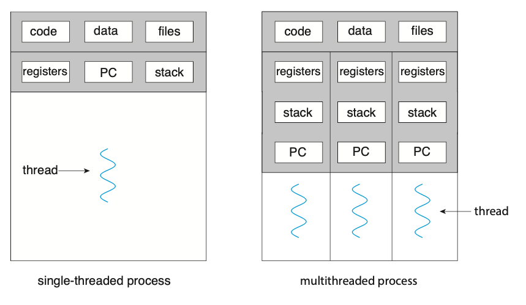
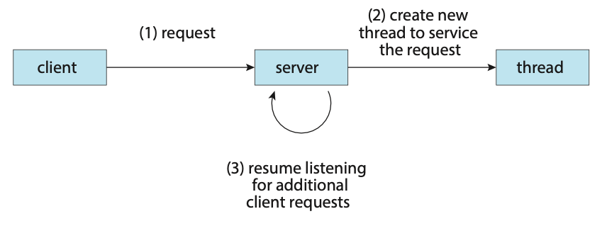
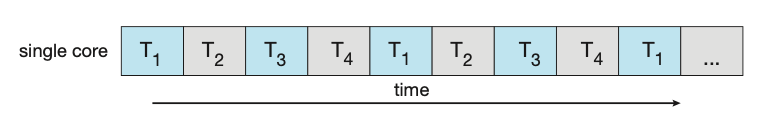
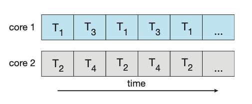
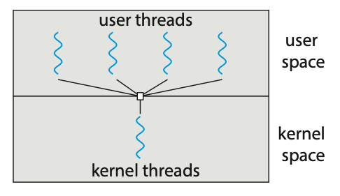
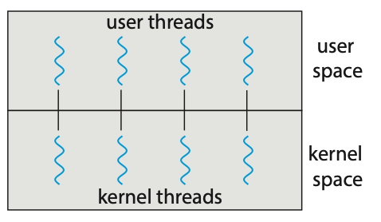
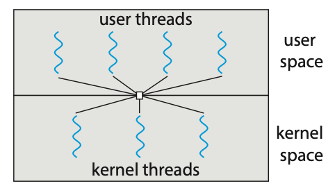

# Threads

A thread is a basic unit of CPU utilisation. A thread consists of:
- A thread ID
- A program counter PC
- A register set 
- A stack

A thread shares it's code section, data section, and other operating-system resources
with others threads within the same process. A traditional process usually consists
of a single thread of control, this is called a single-threaded process. A process
with multiple threads of control can therefore perform more than one task at
any given moment, this is called a multi-threaded process.


**Figure: Single-threaded and multithreaded processes.**

Most programs that run on modern computers and mobile devices are multithreaded.
For example, A word processor may have a thread for displaying graphics, another 
thread for responding to keystrokes from the user, and a third thread for performing 
spelling and grammar checking in the background.

In certain situations, a single application may be required to perform several 
tasks at any one time. For example, a web server needs to accept many client requests
concurently. A solution to this is to have the server run a single process that 
accepts requests. When a request is recieved, a new process is created to service
the request. Before threads became popular, this was the most common way to handle
such situation.

The problem with this however is that processes are expensive to create. If the
new process will perform the same tasks as the existing process, why incur the
overhead of creating another. If a web server is multithreaded, the server will
create a separate thread that listens for client requests. When a new requests
comes in, the server will create a new thread to service the requests and resume
listening for more requests.


**Figure: Multithreaded server architecture.**

Most operating system kernels are also typically multithreaded. During system
boot time on Linux systems, several kernel threads are created to handle tasks
such as managing devices, memory management, and interrupt handling.

There are many benefits to using a multithreaded programming approach:
1. **Responsiveness**: Multithreading an interactive application may allow a 
program to continue running even if part of it is blocked or is performing a 
lengthy operation.
2. **Resouce sharing**: Processes can share resources only through techniques 
such as shared memory and message passing. However, threads share the memory and 
the resources of the process to which they belong by default.
3. **Economy**: Allocating memory and resources for process creation is costly. 
Because threads share the resources of the process to which they belong, it is 
more economical to create and context-switch threads.
4. **Scalability**: The benefits of multithreading can be even greater in a 
multiprocessor architecture, where threads may be running in parallel on different 
processing cores.

## Multicore Programming
Due to the need for more computing performance, single-CPU systems evolved into
multi-CPU systems. A trend in system design was to place multiple computing cores
on a single processing chip where each core would then appear as a separate CPU 
to the operating system, such systems are referred to as multicore systems.

Imagine an application with four threads. On a system with a single computing core,
concurrency merely means that the execution of the threads will be interleaved
over time due to the processing core only being capable of executing a single
thread at a time.


**Figure: Concurrent execution on a single-core system.**

On a system with multiple cores, concurrency means that some threads can run in
parallel due to the system being capable of assigning a separate thread to each
core.

  
**Figure: Parallel execution on a multicore system.**

## Types of Parallelism
There are two types of parallelism:
1. **Data parallelism**: Focuses on distributing subsets of the same data across 
multiple computing cores and performing the same operation on each core.
2. **Task parallelism**: Involves distributing not data but tasks (threads) 
across multiple computing cores. Each thread is performing a unique operation. 
Diferent threads may be operating on the same data, or they may be operating on 
different data.

It's important to note that these two methods are not mutually exclusive and an
application may use a hybrid method of both strategies.

## Multithreading Models
Support for threads may be provided either at the user level (user threads) or
by the kernel (kernel threads). User threads are supported above the kernel and
are managed without kenel support. Kernel threads on the other hand are supported
and managed directly by the operating system.

There are three common relationships between user threads and kernel threads.
1. **Many-to-One Model**: The many-to-one model maps many user-level threads to 
one kernel thread. Thread management is done by the thread library in user space, 
so it is efficient. However, the entire process will block if a thread makes a 
blocking system call. Also, because only one thread can access the kernel at a time, 
multiple threads are unable to run in parallel on multicore systems.  

  
**Figure: Many-to-one model.**

2. **One-to-One Model**: The one-to-one model maps each user thread to a kernel 
thread. It provides more concurrency than the many-to-one model by allowing another 
thread to run when a thread makes a blocking system call. It also allows multiple 
threads to run in parallel on multiprocessors. The only drawback to this model 
is that creating a user thread requires creating the corresponding kernel thread, 
and a large number of kernel threads may burden the performance of a system.  

  
**Figure: One-to-one model.**

3. **Many-to-Many Model**: The many-to-many model (Figure 4.9) multiplexes many 
user-level threads to a smaller or equal number of kernel threads. Although the 
many-to-many model appears to be the most flexible of the models discussed, in 
practice it is difficult to implement.

  
**Figure: Many-to-many model.**

## Creating Threads
There are two general strategies forr creating multiple threads:
1. **Asynchronous threading**: Once the parent creates a child thread, the parent 
resumes its execution, so that the parent and child execute concurrently and 
independently of one another.
2. **Synchronous threading**: The parent thread creates one or more children and 
then must wait for all of its children to terminate before it resumes. Here, the 
threads created by the parent perform work concurrently, but the parent cannot 
continue until this work has been completed. Once each thread has finished its 
work, it terminates and joins with its parent. Only after all of the children 
have joined can the parent resume execution.

## Pthreads
Pthreads refers to the POSIX standard (IEEE 1003.1c) defining an API fo thread
creation and synchronisation. It's important to know that Pthreads is simply a
specification for thread behaviour and not an implementation, that is left up to
the operating-system designers.

Below is an example application using Ptheads to calculate the summation of a 
non-negative integer in a separate thread.

```c
#include <pthread.h>
#include <stdio.h>
#include <stdlib.h>

int sum; // The data shared among the threads.
void *runner(void *param); // The function called by each thread.

int main(int argc, char *argv[]) {
    pthread_t tid; // The thread identifier.
    pthread_attr_t attr; // Set of thread attributes.

    // Set the default attributes of the thread.
    pthread_attr_init(&attr);

    // Create the thread.
    pthread_create(&tid, &attr, runner, argv[1]);

    // Wait for the thead to finish executing.
    pthead_join(tid, NULL);

    printf("Sum: %d\n", sum);
}

void *runner(void *param) {
    int upper = atoi(param);
    int sum = 0;

    for (int i = 1; i <= upper; i++) {
        sum += 1;
    }

    pthread_exit(0);
}
```

This example program creates only a single thread. With the growing dominance of 
multicore systems, writing programs containing several threads has become increasingly 
common. A simple method for waiting on several threads using the `pthread_join()` 
function is to enclose the operation within a simple for loop.

```c
#define NUM_THREADS 10

pthread_t workers[NUM_THREADS];

for (int i = 0; i < NUM_THREADS; i++) {
    pthread_join(workers[i], NULL);
}
```

## Thread Pools
The idea behing a thread pool is to create a number of threads at start-up and
place them into a pool where they sit and wait for work. In the context of a web
server, when a request is recieved, rather than creating a new thread, it instead
submits the request to the thread pool and resumes waiting for additional requests.
Once the thread completes its service, it returns to the pool and awaits more 
work.

A thread pool has many benefits such as:
- Servicing a equest within an existing thead is often faster than waiting to 
create a new thread.
- A thread pool limits the number of threads that exist at any one point. This
ensures that the system does not get overwhelmed when creating more threads than
it can handle.
- Separating the task to be performed from the mechanics of creating the task 
allows us to use different strategies for running the task. For example, the task 
could be scheduled to execute after a time delay or to execute periodically.

The number of threads in the pool can be set heuristically based on factors such
as the number of CPUs in the system, amount of physical memory, and the expected
number of concurrent client requests. More sophisticated thread pool architectures
are able to dynamically adjust the number of threads in the pool based off usage
patterns.

## Fork Join
The fork-join method is one in which when the main parent thread creates one or 
more child threads and then waits for the children to terminate and join with it.

This synchronous model is often characterised as explicit thread creation, but 
it is also an excellent candidate for implicit threading. In the latter situation, 
threads are not constructed directly during the fork stage; rather, parallel 
tasks are designated. A library manages the number of threads that are created 
and is also responsible for assigning tasks to threads.

## Threading Issues
- **The `fork()` and `exec()` system calls**
- **Signal handling**
- **Thread cancellation**
- **Thread-local storage**
- **Scheduler activations**
