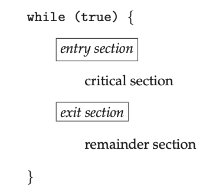

# Synchronisation

A cooperating process is one that can affect or be affected by other processes 
executing in the system. Cooperating processes can either directly share a logical
address space or be allowed to share data through shared memory or message passing.
Concurrent access to shared data may result in data inconsistency.

A race condition occurs when several processes access and manipulate the same 
data concurrently and the outcome of the execution depends on the particular order 
in which the access takes place.

## The Critical-Section Problem
Consider a system of \\(n\\) processes. Each proces has a segment of code, called
the critical section, in which the process may be accessing - and updating - data
that is shared with at least one other process. When one process is executing in 
its critical section, no other process is allowed  to execute in its critical 
section. The critical-section problem is to design a protocol that the processes 
can use to synchronise their activity so as to cooperatively share data.

Each process must request permission to enter its critical section. The code
implementing this request is the entry section. The critical section may be followed 
by an exit section. The remaining code is the remainder section.

  
**Figure: General structure of a typical process.**

A solution to the critical-section problem must satisfy the following three
requirements:
1. **Mutual exclusion**: If process \\(P_i\\) is executing in its critical section,
then no other process can be executing in their critical sections.
2. **Progress**: If no process is executing in its critical section and some processes
wish to enter their critical sections, then only those processes that are not executing
in their remainder sections can participate in deciding which will enter its critical 
section next, and this selection cannot be postponed indefinitely.
3. **Bounded waiting**: There exists a bound, or limit, on the number of times 
that other processes are allowed to enter their critical sections after a process 
has made a request to enter its critical section and before that request is granted.

There are two general approaches used to handle critical sections in operating
systems:
1. **Preemptive kernels**: A preemptive kernel allows a process to be preemped while 
it's running in kernel mode.
2. **Non-preemptive kernels**: A non-preemptive kernel does not allow a process running
in kernel mode to be preempted; A kernel-mode process will run until it exits kernel
mode, blocks, or voluntarily yields control of the CPU.

A non-preemptive kernel is essentially free from race conditions on kernel data
structures as only one process is active in the kernel at a time. Preemptive
kernels on the other hand are not and must be carefully designed to ensure that 
shared kernel data is free from race conditions.

Despite this, preemptive kernels are still preferred as:
- They allow a real-time process to preempt a process currently running in kernel 
mode
- They are more responsive since there is less risk that a kernel-mode process 
will run for an arbitrarily long period before relinquishing the processor to 
waiting processes.

## Peterson's Solution
Peterson's solution is a software-based solution to the critical-section problem.
Due to how modern computer architectures perform basic machine-language instructions,
there are no guarantees that Peterson's solution will work correctly on such
architectures.

```
int turn;
boolean flag[2];

while (true) {
    flag[i] = true;
    turn = j;

    while (flag[j] && turn == j);

    // Critical section

    flag[i] = false;

    // Remainder section
}
```

## Hardware Support for Synchronisation

### Memory Barriers
How a computer architecture determines what memory guarantees it will provide
to an application program is known as its memory model. A memory model falls into
one of two categories:
1. **Strongly ordered**: Where a memory modification on one processor is immediately
visible to all other processors.
2. **Weakly ordered**: Where modifications to memory on one processor may not be.
immediately visible to other processors.

Memory models vary by processor type, so kernel developers cannot make assumptions
regarding the visibility of modifications to memory on a shared-memory multiprocessor.
To address this issue, computer architectures provide instructions that can force
any changes in memory to be propagated to all other processors. Such instructions
are know as memory barriers or memory fences.

When a memory barrier instruction is performed, the system ensures that all loads
and stores are completed before any subsequent load or store operations are performed.
This ensures that even if instructions were re-ordered, the store operations are
completed in memory and visible to other processors before future load or store
operations are performed.


Memory barriers are considered very low-level operations are are typically only
used by kernel developers when writing specialised code that ensures mutual
exclusion.

### Hardware Instructions
Many computer systems provide special hardware instructions that allow us either 
to test and modify the content of a word or to swap the contents of two words
atomically - that is, as one uninterruptible unit. These special instructions 
can be used to solve the critical-section problem. Such examples of these instructions
are [`test_and_set()`](https://en.wikipedia.org/wiki/Test-and-set) and 
[`compare_and_swap`](https://en.wikipedia.org/wiki/Compare-and-swap).

```c
boolean test_and_set(boolean *target) {
    boolean rv = *target;
    *target = true;

    return rv;
}
```
**Figure: The definition of the atomic `test_and_set()` instruction.**

```c
int compare_and_swap(int *value, int expected, int new_value) {
    int temp = *value;

    if (*value == expected) {
        *value = new_value;
    }

    return temp;
}
```
**Figure: The definition of the atomic `compare_and_swap()` instruction.**

### Atomic Variables
An atomic variable provides atomic operations on basic data types such as integers
and booleans. Most systems that support atomic variables provide special atomic 
data types as well as functions for acessing and manipulating atomic variables.
These functions are often implemented using `compare_and_swap()` operations.

For example, the following increments the atomic integer sequence:

```c
increment(&sequence);
```

where the `increment()` function is implemented using the CAS instruction:

```c
void increment(atomic_int *v) {
    int temp;

    do {
        temp = *v;
    } while (temp != compare_and_swap(v, temp, temp + 1));
}
```

It's important to note however that although atomic variables provide atomic 
updates, they do not entirely solve race conditions in all circumstances.

## Mutex Locks
Mutex, short for mutual exclusion, locks are used to protect critical sections 
and thus prevent race conditions. They act as high-level software tools to solve
critical-section problems.

A process must first acquire a lock before entering a critical section; it then
releases the lock when it exits the critical section. The `acquire()` function
acquires the lock, and the `release()` function releases the lock. A mutex lock 
has a boolean variable `available` whose value indicates if the lock is available 
or not. Calls to either `acquire()` or `release()` must be performed atomically.

```
acquire() {
    while (!available); /* busy wait */
    available = false;;
}

release() {
    available = true;
}
```

The type of mutex lock described above is also called a spin-lock due to the 
process "spinning" while waiting for the lock to become available. The main 
disadvantage with spin locks is that they require busy waiting. While a process 
is in its critical section, any other process that tries to entir its critical 
section must loop continuously in the call to `acquire()`. This wastes CPU cycles 
that some other process might be able to use productively. On the other hand, 
spinlocks do have an advantage in that no context switch is required when a process
must wait on a lock.

## Semaphores
A semaphore \\(S\\) is an integer variable that, apart from initialisation, is
accessed only through two standard atomic operations: `wait()` and `signal()`.

Operating systems often distinguish between counting and binary semaphores. The
value of a counting semaphore can range over an unrestricted domain. The value
of a binary semaphore can range only between 0 and 1. 

Counting semaphores can be used to control access to a given resource consisting
of a finite number of instances. The semaphore is initialised to a number of 
resources available. Each process that wishes to use a resource performs a `wait()`
operation on the semaphore (decrementing the count). When a process releases 
resource, it performs a `signal()` operation (incrementing the count). When the 
count for the semaphore goes to 0, all resources are being used. Processes wishing 
to use a resource will block until the count becomes greater than 0.

```
wait(S) {
    while (S <= 0); // busy wait
    S--;
}

signal (S) {
    S++;
}
```
**Figure: Semaphore with busy waiting.**

It's important to note that some definitions of the `wait()` and `signal()` 
semaphore operations, like the example above, present the same problem that 
spinlocks do, busy waiting. To overcome this, other definition of these functions 
are modified as to when a process executes `wait()`, it suspends itself rather 
than busy waiting. Suspending the process puts it back a waiting queue associated 
with the semaphore. Control is then transferred to the CPU scheduler, which selects 
another process to execute. A process that is suspended, waiting on a semaphore 
\\(S\\), should be restarted when some other process executes a `signal()` operation. 
A process that is suspended can be restarted by a `wakeup()` operation which 
changes the process from the waiting state to the ready state subsequently placing 
it into the ready queue.

```
typedef struct{
    int value;
    struct process *list;
} semaphore;

wait(semaphore *S) {
    S->value--;

    if (S->value < 0) {
        add this process to S->list;
        block();
    }
}

signal(semaphore *S) {
    S->value++;

    if (S->value <= 0) {
        remove a process P from S->list;
        wakeup(P);
    }
}
```
**Figure: Semaphore without busy waiting.**

## Monitors
An abstract data type - or ADT - encapsulates data with a set of functions to
operate on that data that are independent of any specific implementation of the
ADT. A monitor type is an ADT that includes a set of programmer-defined operations
that are provided with mutual exclusion within the monitor. The monitor type
also declares the variables whose values define the state of an instance of that
type, along with the bodies of functions that operate on those variables.

The representation of a monitor type cannot be used directly by the various 
processes. Thus, a function defined within a monitor can access only those variables 
declared locally within the monitor and its formal parameters. Similarly, the 
local variables of a monitor can be accessed by only the local functions.

The monitor construct ensures that only one process at a time is active within 
the monitor. Consequently, the programmer does not need to code this synchronization 
constraint explicitly. In some instances however, we need to define additional 
synchronization mechanisms. These mechanisms are provided by the `condition` 
construct. A programmer who needs to write a tailor-made synchronization scheme 
can define one or more variables of type condition. The only operations that can 
be invoked on a condition variable are `wait()` and `signal()`.

The `wait()` means that the process invoking this operation is suspended until 
another process invokes whereas the `signal()` operation resumes exactly one 
suspended process. If no process is suspended, then the `signal()` operation has 
no effect. Contrast this operation with the `signal()` operation associated with 
semaphores, which always affects the state of the semaphore.

Now suppose that, when the `x.signal()` operation is invoked by a process \\(P\\), 
there exists a suspended process \\(Q\\) associated with condition `x`. Clearly, 
if the suspended process \\(Q\\) is allowed to resume its execution, the signaling 
process \\(P\\) must wait. Otherwise, both \\(P\\) and \\(Q\\) would be active 
simultaneously within the monitor. Two possibilities exist:
1. **Signal and wait**: \\(P\\) either waits until \\(Q\\) leaves the monitor 
or waits for another condition.
2. **Signal and continue**: \\(Q\\) either waits until \\(P\\) leaves the monitor 
or waits for another condition.

## Liveness
Liveness refers to a set of properties that a system must satisfy to ensure that 
processes make progress during their execution life cycle. A process waiting
indefinitely is an example of a "liveness failure". There are many different
forms of liveness failure; however, all are generally characterised by poor
performance and responsiveness.

### Deadlock
The implementation of a semaphore with a waiting queue may result in a situation 
where two or more processes are waiting indefinitely for an event that can be
caused only by one of the waiting processes. When such a state is reached, these
processes are said to be deadlocked.

### Priority Inversion
A scheduling challenge arises when a higher-priority process needs to read or 
modify kernel data that are currently being accessed by a lower-priority process 
— or a chain of lower-priority processes. Since kernel data are typically protected 
with a lock, the higher-priority process will have to wait for a lower-priority 
one to finish with the resource. The situation becomes more complicated if the 
lower-priority process is preempted in favor of another process with a higher 
priority.

This liveness problem is known as priority inversion, and it can occur only in 
systems with more than two priorities. Typically, priority inversion is avoided 
by implementing a priority-inheritance protocol. According to this protocol, 
all processes that are accessing resources needed by a higher-priority process 
inherit the higher priority until they are finished with the resources in question. 
When they are finished, their priorities revert to their original values.
