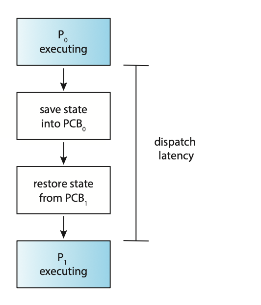
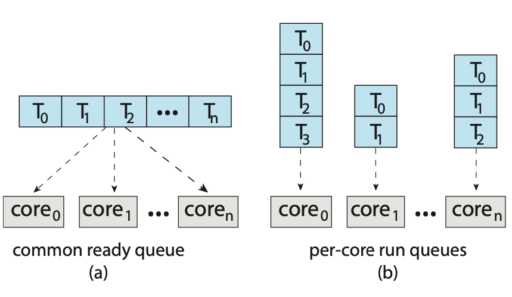
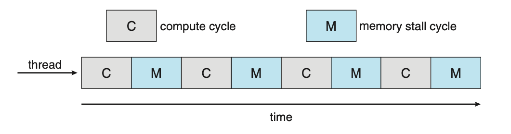
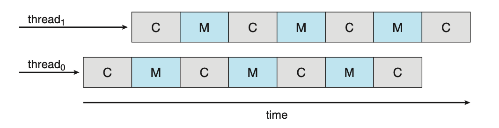
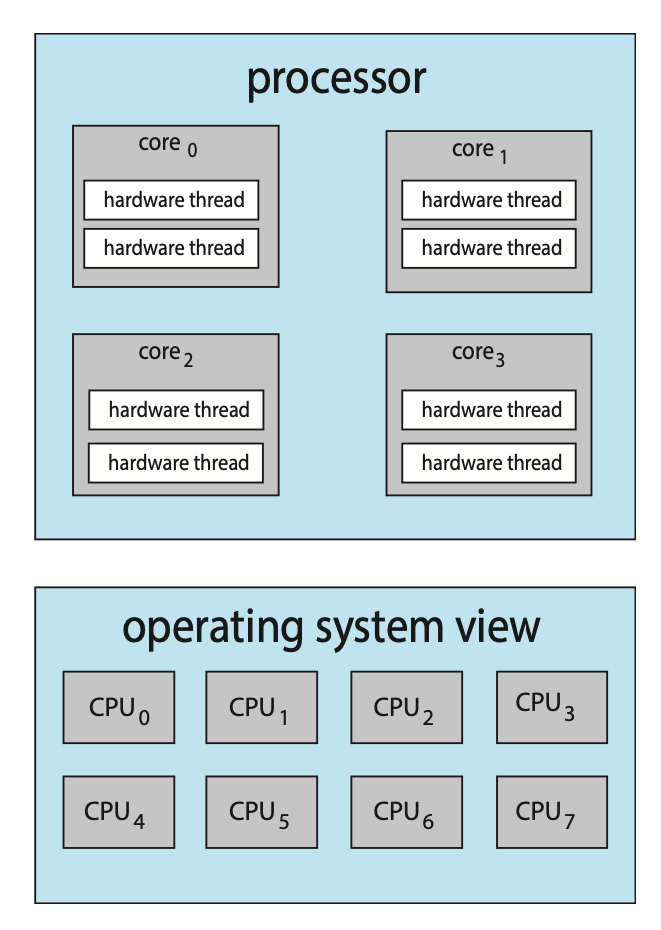

# CPU Scheduling

In a system with a single CPU core, only one process can run at a time. A process
is executed until it must wait. With multi-pogramming, multiple processes are
kept in memory at one time. When one process has to wait, the OS takes the CPU
away from that process and gives the CPU to another process. This selection process
is caried out by the CPU schedule. It's important to note that the queue of ready
items is not necessarily a FIFO queue. The records in the queue are typically
pocess control blocks (PCBs) of the processes.

CPU scheduling decisions may take place under the following four circumstances:
1. When a process switches from the running state to the waiting state.
2. When a pocess switches fom the running state to the ready state.
3. When a process switches from the waiting state to the ready state.
4. When a process terminates.

When scheduling takes place under circumstances 1 and 4, the scheduling scheme
is non-preemptive or cooperative, otherwise, it is preemptive.

Under non-preemptive scheduling, once the CPU has been allocated to a process,
the process keeps the CPU until it releases it either by termination or by switching 
to the waiting state. The majority of modern operating systems use non-preemptive
scheduling algorithms. Preemptive scheduling can however, result in race conditions 
when data is shared among several processes. 

A non-preemptive kernel will wait for a system call to complete or for a process 
to block while waiting for I/O to complete to take place before doing a context 
switch. A preemptive kernel requires mechanisms such as mutex locks to prevent
race conditions when accessing shaed kernel data structues.

Due to interrupts being able to occur at any time, and becuase they cannot always
be ignored by the kernel, sections affected by interrupts must be guarded from
simultaneous use. So that these sections of code are not accessed concurrently 
by several processes, they disable interupts at entry and re-enable them at exit.

## Dispatcher
A dispatcher is a module that gives control of the CPUs core to a process selected
by the CPU scheduler. This involves tasks such as:
- Switching context from one process to another.
- Switching to user mode.
- Jumping to the proper location in the user program to resume that program.

Due to the dispatcher being invoked during every context switch it must be fast.
The time it takes for the dispatcher to stop one process and start another is
known as dispatch latency.

  
**Figure: The role of the dispatcher**

A voluntary context switch occurs when a process has given up contol of the CPU
because it requires a resource that is currently unavailable. A non-voluntary
context switch occurs when the CPU has been taken away from a process. This can
occur when its time slice has expired, its been preempted by a higher-priority
process, and more.

Using the `/proc` file system, the number of context switches for a given process
can be detemined. For example, the contents of the file `/proc/2166/status` provides
the following trimmed output:

```
voluntary_ctxt_switches       150
nonvoluntary_ctxt_swtiches    8
```

The Linux command `vmstat` can also be used to see the number of context switches
on a system-wide level.

## Scheduling Criteria
Different CPU scheduling algorithms have diffeernt properties and the choice
of a particular algorithm may favour one class of process over another.

Many critera have been suggested for comparing CPU scheduling alogrithms:
- **CPU utilisation**: We want to keep the CPU as busy as possible. Conceptually, 
CPU utilization can range from 0 to 100 percent. In a real system, it should range 
from 40 percent (for a lightly loaded system) to 90 percent (for a heavily loaded 
system).
- **Throughput**: If the CPU is busy executing processes, then work is being done. 
One measure of work is the number of processes that are completed per time unit, 
called throughput.
- **Turn-around time**: From the point of view of a particular process, the 
important criterion is how long it takes to execute that process. The interval 
from the time of submission of a process to the time of completion is the turnaround 
time. Turnaround time is the sum of the periods spent waiting in the ready queue, 
executing on the CPU, and doing I/O.
- **Waiting time**: The CPU scheduling algorithm does not affect the amount of 
time during which a process executes or does I/O. It only affects the amount of 
time that a process spends waiting in the ready queue. Waiting time is the sum 
of the periods spent waiting in the ready queue.
- **Response time**: In an interactive system, turnaround time may not be the 
best criterion. Often, a process can produce some output fairly early and can 
continue computing new results while previous results are being output to the 
user. Thus, another measure is the time from the submission of a request until 
the first response is produced. This measure, called response time, is the time 
it takes to start responding, not the time it takes to output the response.

In general, it is desirable to maximise CPU utilisation and thoughput, but 
minimise turnaround time, waiting time, and response time. In some cases however,
we may prefer to optimize the minimum or maximum values rather than the average.

## CPU Scheduling Alogrithms

- **First-Come, First-Served Scheduling**: First-come, first-served (FCFS) scheduling
is the simplest scheduling algorithm, but it can cause short processes to wait 
for very long processes.
- **Shortest-Job-First Scheduling**: Shortest-job-first (SJF) scheduling is provably
optimal, providing the shortest average waiting time. Implementing SJF scheduling 
is difficult, how- ever, because predicting the length of the next CPU burst is 
difficult.
- **Round-Robin Scheduling**: Round-robin (RR) scheduling allocates the CPU to 
each process for a time quantum. If the process does not relinquish the CPU before 
its time quantum expires, the process is preempted, and another process is scheduled 
to run for a time quantum.
- **Priority Scheduling**: Priority scheduling assigns each process a priority,
and the CPU is allocated to the process with the highest priority. Processes with 
the same priority can be scheduled in FCFS order or using RR scheduling.
- **Multilevel Queue Scheduling**: Multilevel queue scheduling partitions processes 
into several separate queues arranged by priority, and the scheduler executes the 
processes in the highest-priority queue. Different scheduling algorithms may be 
used in each queue.
- **Multilevel Feedback Queue Scheduling**: Multilevel feedback queues are similar
to multilevel queues, except that a process may migrate between different queues.

## Thread Scheduling
On systems implementing the many-to-one and many-to-many models for thread management,
the thread library schedules user-level threads to run on an available lightweight
process (LPW). This scheme is known as process-contention scope (PCS) as competition
for the CPU takes place among threads belonging to the same process. To determine
which kernel-level thread to schedule onto a CPU, the kenel uses system-contention
scope (SCS). Competition for the CPU with SCS scheduling takes place among all 
threads in the system. Systems that use the one-to-one model schedule threads
use only SCS.

Typically, PCS is done according to priority. User-level thread priorities
are set by the programmer and are not adjusted by the thread libray. PCS will
typically preempt the thread currently running in favor of a higher-priority 
thread; however, there is no guarantee of time slicing among threads of equal
priority.

Pthreads identifies the following contention scope values:
- `PTHREAD_SCOPE_PROCESS` schedules threads using PCS scheduling.
- `PTHREAD_SCOPE_SYSTEM` schedules threads using SCS scheduling.

On systems implementing the many-to-many model, the `PTHREAD_SCOPE_PROCESS` policy
schedules user-level threads onto available LWPs. The `PTHREAD_SCOPE_SYSTEM` 
scheduling policy will create and bind an LWP for each user-level thread on
many-to-many systems. This effectively maps threads using the one-to-one policy.

The Pthread IPC provides two functions for setting and getting the contention
scope policy:
- `pthread_attr_setscope(pthread_attr_t *attr, int scope)`
- `pthread_attr_getscope(pthread_attr_t *attr, int *scope)`

Below is an example program that will first determine the existing contention 
scope and set it to `PTHREAD_SCOPE_SYSTEM`. It will then create five separate
threads that will run using the SCS scheduling policy. It's important to note 
that on some systems, only certain contention scope values are allowed, i.e. 
Linux and macOS only allow `PTHREAD_SCOPE_SYSTEM`.

```c
#include <pthread.h>
#include <stdio.h>

#define NUM_THREADS 5

void *runner(void *param);

int main(void) {
    int scope;
    pthread_t tid[NUM_THREADS];
    pthread_attr_t attr;

    pthread_attr_init(&attr);

    if (pthread_attr_getscope(&attr, &scope) != 0) {
        fprintf(stderr, "[Error] - Unable to get scheduling scope.\n");
    } else {
        if (scope == PTHREAD_SCOPE_PROCESS) {
            printf("PTHREAD_SCOPE_PROCESS\n");
        } else if (scope == PTHREAD_SCOPE_SYSTEM) {
            printf("PTHREAD_SCOPE_SYSTEM\n");
        } else {
            fprintf(stderr, "[Error] - Illegal scope value.\n");
        }
    }

    pthread_attr_setscope(&attr, PTHREAD_SCOPE_SYSTEM);

    for (size_t i = 0; i < NUM_THREADS; i++) {
        pthread_create(&tid[i], &attr, runner, NULL);        
    }

    for (size_t i = 0; i < NUM_THREADS; i++) {
        pthread_join(tid[i], NULL);
    }
}

void *runner(void *param) {
    // Do some work

    pthread_exit(0);
}
```

## Multi-Processor Scheduling
If multiple CPUs are available, load sharing, where multiple threads may run
in parallel, becomes possible, however scheduling issues become correspondingly
more complex.

Traditionally, the term multiprocessor reffered to systems that provided multiple
physical processors. However, the definition of multiprocessor now applies to the
following system architectures:
- Multicore CPUs
- Multithreaded cores
- NUMA systems
- Hetorogeneous multiprocessing

One approach to CPU scheduling in a multiprocessor system has all scheduling
decisions, I/O processing, and other system activites handled by a single processor
called the master server. The other processors execute only user code. This 
asymmetric multiprocessing is simple because only one core accesses the system
data structures, reducing the need for data sharing. The downfall for this approach
however is that the master server becomes a potential bottleneck.

The standard approach for supporting multiprocessors is symmetrical multiprocessing
(SMP), where each processor is self-scheduling. The scheduler for each process
examines the ready queue and selects a thread to run. This provides two possible
strategies for organising the threads eligible to be scheduled:
1. All threads may be in a common ready queue.
2. Each process may have its own private queue of threads.

  
**Figure: Organisation of ready queues.**

If option one is chosen, a possible race condition on the shared ready queue
could occur and therefore must ensure that two spearate processors do not
choose to schedule the same thread and that threads are not lost from the queue.
To get around this, locking could be used to protect the common ready queue.
This is not a great solution however, as all access to the queue would require 
lock ownership therefore accessing the shared queue would likely be a performance
bottleneck.

The second option permits each processor to schedule threads from its private
run queue. This is the most common approach on systems supporting SMP as it does 
not suffer from the possible performance problems associated with a shared run 
queue. There are possible issues with per-processor run queues such as workloads
of varying size. This however, can be solved with balancing algorithms which
equalise workloads among all processors.

## Multicore Processors
Traditionally, SMP systems have allowed several processes to run in parallel by
providing multiple physical processors. However, most contempory computer hardware
now places multiple computing cores on the same physical chip resulting in a 
multicore processor. SMP systems that use multicore processors are faster and
consume less power than systems in which each CPU has its own physical chip.

Multicore processors however, may complicate scheduling issues. When a processor 
accesses memory, it spends a significant amount of time waiting for the data to 
become available. This is known as a memory stall and occurs primarily because
modern processors operate at much faster speeds than memory. A memory stall can
also occur because of a cache miss, the accessing of data that is not in cache 
memory. 

  
**Figure: Memory stall.**

To remedy this, many recent hardware designs have implemented multithreading
processing cores in which two, or more, hardware threads are assigned to each 
core. If one hardware thread stalls, the core can switch to another thread.

  
**Figure: Multithreaded multicore system.**

From an operating systems perspective, each hardware thread maintains its architectural
state thus appearing as a logical CPU. This is known as chip multithreading (CMT).
Intel processors use the term hyper-threading, or simultaneous multithreading, 
to describe assigning multiple hardware threads to a single processing core.

  
**Figure: Chip multithreading.**

In the above diagram, the processor contains four computing cores, each containing
two hardware threads. From the perspective of the operating system, there are 
eight logical CPUs.

There are two ways to multithread a processing core:
1. Coarse-grained multithreading
2. Fine-grained multithreading

With coarse-grained multithreading, a thread executes on a core until a long-latency
event occurs. Due to the delay caused by the long-latency event, the core must 
switch to another thread to begin execution, this is expensive. Fine-grained
multithreading switches between threads at a much finer level of granularity.
The architectural design of fine-grained systems includes logic for thread switching
resulting in a low cost for switching between threads.

A multithreaded, multicore processor requires two different levels of scheduling.
This is because the resources of the physical cores must be shared among its hardware
threads and can therefore only execute one hardware thread at a time. On one level
are the scheduling decisions that must be made by the operating system as it
chooses which software thread to run on each hardware thread. A second level of
scheduling specifies how each core decides which hardware thread to run. These
two levels are not necessarily mutally exclusive.

## Load Balancing
Load balancing attempts to keep the workload evenly distributed across all processors
in an SMP system. Load balancing is typically necessary only on systems where 
each processor has its own private ready queue. On systems with a common run queue,
one a processor becomes idle, it immediately extracts a runnable thread from the
common ready queue.

There are two general approaches to load balancing:
- **Push migration**: A specific task periodically checks the load on each processor 
and, if it finds an imbalance, evenly distributes the load by moving (or pushing)
threads from the overloaded to idle or less-busy processors.
- **Pull migration**: A pull migration occurs when an idle processor pulls a 
waiting task from a busy processor.

The concept of a balanced load may have different meanings. One view may be that
a balanced load requires that all queues have approximately the same number of
threads while another view may be that there must be an equal distribution of 
thread priorities across all queues.

## Processor Affinity
As a thread runs on a specific processor, the data it uses populates the processors 
cache. If the thread is required to migrate to another process, the contents of 
the cached memory must be invalidated for the first processor, and the cache for 
the second processor must be repopulated. This is a high cost operation and most
operating systems, with the aid of SMP, try to avoid migrating a thread from one
processor to another. Instead, they attempt to keep a thread running on the same 
processor to take advantage of the "warm" cache. This is known as processor affinity,
that is, a process has an affinity for the processor on which is is currently 
running.

If the approach of a common ready queue is adopted, a thread may be selected for 
execution by any processor. Thus, if a thread is scheduled on a new processor, 
that processor’s cache must be repopulated. With private, per-processor ready 
queues, a thread is always scheduled on the same processor and can therefore 
benefit from the contents of a warm cache, essentially providing processor 
affinity for free.

Soft affinity occurs when the operating system has a policy of attempting to 
keep a process running on the same process but doesn't guarantee it will do so.
In contrast, some systems provide system calls that support hard affinity, thereby
allowing a process to specify a subset of processors on which is can run.

## Real-Time CPU Scheduling
Soft real-time systems provide no guarantee as to when a critical real-time 
process will be scheduled. They guarantee only that the process will be given
preference over non-critical processes. In a hard real-time system, a task must
be serviced by its deadline; service after the deadline has expired is the same
as no service at all.

### Minimising Latency

Event latency is the amount of time that elapses from when an event occurs to when
it's serviced. Different events have different latency requirements. For example,
the latency requirement for an antilock brake system may be between 3 to 5 milliseconds
while an embedded system controlling a radar in an airliner might tolerate a 
latency period of several seconds.

  
**Figure: Event latency.**

Two types of latencies affect the performance of real-time systems:
1. **Interrupt latency**: The period of time from the arrival of an interrupt to the 
CPU to the start of the routine that services the interrupt.
2. **Dispatch latency**: The amount of time required for the scheduling dispatcher
to stop one process and start another.

### Priority-Based Scheduling
TODO
### Rate-Monotonic Scheduling
TODO
### Earliest-Deadline-First Scheduling
TODO
### Proportional Share Scheduling
TODO
### POSIX Real-Time Scheduling
TODO
