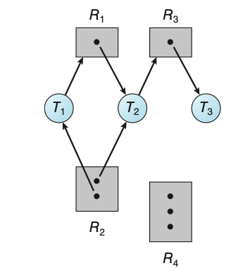
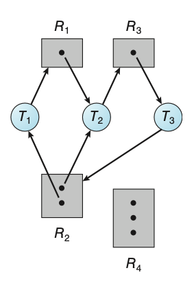

# Deadlocks
In a multi-programming environment, several threads may compete for a finite 
number of resources. A thread requests resources; if the resources are not available
at that time, the thread enters a waiting state. Sometimes, a waiting thread can
never again change state because the resources it has requested are heldd by other 
waiting threads. This is what is referred to as a deadlock. 

A thread must request a resource before using it and must release the resource 
after using it. A thread may request as many resources as it requires to carry
out its designated task. The number of resources requested may not exceed the 
total number of resources available in the system.

Under the normal mode of operation, a thread may utilise a resource in only the
following sequence:
1. **Request**: The thread requests the resource. If the request cannot be granted
immediately, then the requesting thread must wait until it can acquire the resource.
2. **Use**: The thread can operate on the resource.
3. **Release**: The thread releases the resource.

The request and release of resources may be system calls such as:
- `request()` and `release()` of a device.
- `open()` and `close()` of a file.
- `allocate()` and `free()` memory system calls.

Request and release can alos be accomplished through the `wait()`a nd `signal()` 
operations on semaphores and through `acquire()` and `release()` of a mutex lock.

For each use of a kernel-managed resource by a thread, the operating system checks
to make sure that the thread has requested and has been allocated the resource.
A system table records whether each resource is free or allocated. For each resource
that is allocated, the table also records the thread to which it is allocated.
If a thread requests a resource that is currently allocated to another thread, 
it can be added to a queue of threads waiting for this resource.

```c
// thread_one runs in this function
void *do_work_one(void *param) {
    pthread_mutex_lock(&first_mutex);
    pthread_mutex_lock(&second_mutex);

    // Do some work

    pthread_mutex_unlock(&second_mutex);
    pthread_mutex_unlock(&first_mutex);

    pthread_exit(0);
}

// thread_two runs in this function
void *do_work_two(void *param) {
    pthread_mutex_lock(&second_mutex);
    pthread_mutex_lock(&first_mutex);

    // Do some work

    pthread_mutex_unlock(&first_mutex);
    pthread_mutex_unlock(&second_mutex);

    pthread_exit(0);
}
```
**Figure:** Deadlock example.

## Livelock
Livelock is another form of liveness failure. It is similar to deadlock; both 
prevent two or more threads from proceeding, but the threads are unable to
processed for different reasons. Whereas deadlock occurs when every thread in a 
set is blocked waiting for an event that can be caused only by another thread in
the set, livelock occurs when a thread continuously attempts an action that fails.

Livelock typically occurs when threads retry failing operations at the same time.
It thus can generally be avoided by having each thread retry the failing operation
at random times.

```c
// thread_one runs in this function
void *do_work_one(void *param) {
    int done = 0;

    while (!done) {
        pthread_mutex_lock(&first_mutex);

        if (pthread_mutex_trylock(&second_mutex)) {
            // Do some work

            pthread_mutex_unlock(&second_mutex);
            pthread_mutex_unlock(&first_mutex);

            done = 1;
        } else {
            pthread_mutex_unlock(&first_mutex);
        }
    }

    pthread_exit(0);
}

// thread_two runs in this function
void *do_work_two(void *param) {
    int done = 0;

    while (!done) {
        pthread_mutex_lock(&second_mutex);

        if (pthread_mutex_trylock(&first_mutex)) {
            // Do some work

            pthread_mutex_unlock(&first_mutex);
            pthread_mutex_unlock(&second_mutex);

            done = 1;
        } else {
            pthread_mutex_unlock(&second_mutex);
        }
    }

    pthread_exit(0);
}
```
**Figure:** Livelock example.

## Deadlock Charaterisation
A deadlock situation can arise if the following four conditions hold simultaneously
in the system:
1. **Mutual exclusion**: At least one resource must be held in a non-sharable
mode; that is, only one thread at a time can use the resource. If another thread
requests that resource, the requesting thread must be delayed until the resource
has been released.
2. **Hold and wait**: A thread must be holding at least one resource and waiting
to acquire additional resources that are currently being held by other threads.
3. **No preemption**: Resources cannot be preempted; that is, a resource can be
released only voluntarily by the thread holding it, after that thread has completed
its task.
4. **Circular wait**: A set \\(\\{T_0, T_1, \dots, T_n\\}\\) of waiting threads
must exist such that \\(T_0\\) is waiting for a resource held by \\(T_1\\), \\(T_1\\)
is waiting for a resource held by \\(T_2, \dots, T_{n-1}\\) is waiting for a
resource held by \\(T_n\\), and \\(T_n\\) is waiting for a resource held by \\(T_0\\).

## Resource-Allocation Graph
Deadlocks can be described more precisely in terms of a directed graph called
a system resource-allocation graph. The set of vertices \\(V\\) is partitioned 
into two different types of nodes:
1. \\(T = \\{T_0, T_1, \dots, T_n\\}\\), the set consisting of all the active 
threads in the system.
2. \\(R = \\{R_0, R_1, \dots, R_m\\}\\), the set consisting of all resource types
in the system.

A directed edge from thread \\(T_i\\) to resource type \\(R_j\\) is denoted
\\(T_i \rightarrow R_j\\) and is called a request edge; it signifies that thread 
\\(T_i\\) has requested an instance of resource type \\(R_j\\) and is currently 
waiting for that resource. A directed edge from resource type \\(R_j\\) to thread 
\\(T_i\\) is denoted \\(R_j \rightarrow T_i\\) and is called an assignment edge; 
it signifies that an instance of resource type \\(R_j\\) has been allocated to 
thread \\(T_i\\).

Pictorially, each thread \\(T_i\\) is represented as a circle and each resource 
type \\(R_j\\) as a rectangle. An instance of a resource is represented by a dot
within the rectangle. For example, the below graph depicts the following situation:
- The sets \\(T\\), \\(R\\), and \\(E\\):
    - \\(T = \\{T_1, T_2, T_3\\}\\)
    - \\(R = \\{R_1, R_2, R_3, R_4\\}\\)
    - \\(E = \\{T_1 \rightarrow R_1, T_2 \rightarrow R_3, R_1 \rightarrow T_2, R_2 \rightarrow T_2, R_2 \rightarrow T_1, R_3 \rightarrow T_3\\}\\)
- Resource instances:
    - One instance of resource type \\(R_1\\)
    - Two instances of resource type \\(R_2\\)
    - One instance of resource type \\(R_3\\)
    - Three instances of resource type \\(R_4\\)
- Thread states:
    - Thread \\(T_1\\) is holding an instance of resource type \\(R_2\\) and is
    waiting for an instance of resource type \\(R_1\\).
    - Thread \\(T_2\\) is holding an instance of resource type \\(R_1\\) and an 
    instance of \\(R_2\\) and is waiting for an instance of resource type \\(R_3\\).
    - Thread \\(T_3\\) is holding an instance of resource type \\(R_3\\).

<div align="center">
    
    <figure><strong>Figure:</strong> Resource-allocation graph.</figure>
</div>

Given the definition of a resource-allocation graph, it can be shown that, if 
the graph contains no cycles, then no thread in the system is deadlocked. If
the graph does contain a cycle, then a deadlock may exist.

- If each resource type has exactly one instance, then a cycle implies that a 
deadlock has occurred. 
- If the cycle involves only a set of resource types, each of which has only a 
single instance, then a deadlock has occurred. In this case, a cycle in the graph 
is both a necessary and sufficient condition for the existence of deadlock.
- If each resource type has several instances, then a cycle does not necessarily
imply that a deadlock has occurred. In this case, a cycle in the graph is a necessary
but not a sufficient condition for the existence of deadlock.

<div align="center">
    
    <figure><strong>Figure:</strong> Resource-allocation graph with a deadlock.</figure>
</div>

<div align="center">
    
    <figure><strong>Figure:</strong> Resource-allocation graph with a cycle but no deadlock.</figure>
</div>

If a resource-allocation graph does not have a cycle, then the system is not in
a deadlocked state. If there is a cycle, then the system may or may not be in a
deadlocked state.

## Methods for Handling Deadlocks
A deadlock problem can generally be dealt with in one of three ways:
1. We can ignore the problem altogether and pretend that deadlocks never occur 
in the system.
2. We can use a protocol to prevent or avoid deadlocks, ensuring that the system
will never enter a deadlocked state.
3. We can allow the system to enter a deadlocked state, detect it, and recover.

To ensure that deadlocks never occur, the system can use either a deadlock-prevention
or a deadlock-avoidance scheme. Deadlock prevention provides a set of methods
to ensure that at least one of the necessary conditions cannot hold. These methods
prevent deadlocks by constraining how requests for resources can be made. Deadlock
avoidance requires that the operation system be given additional information in
advance concerning which resources a thread will request and use during its lifetime.
With this additional information, the operating system can decide for each request
whether or not the thread should wait.

## Deadlock Prevention

### Mutual Exclusion
The mutual-exclusion condition must hold. That is, at least one resource must 
be nonsharable. Sharable resources do not require mutually exclusive access and 
thus cannot be involved in a deadlock. Read-only files are a good example of a 
sharable resource. If several threads attempt to open a read-only file at the 
same time, they can be granted simultaneous access to the file. A thread never 
needs to wait for a sharable resource. In general, however, we cannot prevent 
deadlocks by denying the mutual-exclusion condition, because some resources are 
intrinsically nonsharable. For example, a mutex lock cannot be simultaneously 
shared by several threads.

### Hold and Wait
To ensure that the hold-and-wait condition never occurs in the system, we must
guarantee that, whenever a thread requests a resource, it does not hold any other
resources.
- One protocol that can be used requires each thread to request and be allocated
all its resources before it begins execution. This is impractical for most applications
due to the dynamic nature of requesting resources.
- An alternative protocol allows a thread to request resources only when it has
none. A thead may request some resources and use them. Before it can request
additional resources, it must release all the resources that it is currently
allocated.

Both these protocols have two main disadvantages:
1. Resource utilisation may be low since resources may be allocated but unused
for a long period.
2. Starvation is possible. A thread that needs several popular resources may have
to wait indefinitely because at least one of the resources that it needs is always
allocated to some other thread.

### No Preemption
The third necessary condition for deadlocks is that there be no preemption of 
resources that have already been allocated. To ensure that this condition does 
not hold, we can use the following protocol. If a thread is holding some resources 
and requests another resource that cannot be immediately allocated to it (that 
is, the thread must wait), then all resources the thread is currently holding 
are preempted. In other words, these resources are implicitly released. The 
preempted resources are added to the list of resources for which the thread is 
waiting. The thread will be restarted only when it can regain its old resources, 
as well as the new ones that it is requesting. 

Alternatively, if a thread requests some resources, we first check whether they 
are available. If they are, we allocate them. If they are not, we check whether 
they are allocated to some other thread that is waiting for additional resources. 
If so, we preempt the desired resources from the waiting thread and allocate them 
to the requesting thread. If the resources are neither available nor held by a 
waiting thread, the requesting thread must wait. While it is waiting, some of its 
resources may be preempted, but only if another thread requests them. A thread 
can be restarted only when it is allocated the new resources it is requesting 
and recovers any resources that were preempted while it was waiting.

### Circular Wait

TODO: Write about this.

## Deadlock Avoidance
An alternative method for avoiding deadlocks is to require additional information
about how resources are to be requested. The various algorithms that use this
approach differ in the amount and type of information required. The simplest and
most useful model requires that each thread declare the maximum number of resources
of each type that it may need. Given this prior information, it is possible to
construct an algorithm that ensures that the system will never enter a deadlocked
state.

### Safe State
A system is in a safe state only if there exists a safe sequence. In other words, 
a state is safe if the system can allocate resources to each thread in some order
and still avoid a deadlock. A sequence of threads \\(<T_1, T_2, \dots, T_n>\\)
is a safe sequence for the current allocation if, for each \\(T_i\\), the resource
requests that \\(T_i\\) can still make can be satisfied by the current available
resources plus the resources held by all \\(T_j\\), with \\(j < i\\). If no such
sequence exists, then the system state is said to be unsafe.

TODO: Check this content with the lecture.

A safe state is not a deadlocked state. Conversely, a deadlocked state is an 
unsafe state. Not all unsafe states are deadlocks however. As long as the state 
is safe, the operating system can avoid unsafe states.

### Resource-Allocation-Graph Algorithm

TODO:

### Banker's Algorithm

TODO:

### Safety Algorithm

TODO:

### Resource-Request Algorithm

TODO:

## Deadlock Detection

TODO:

## Recovery from Deadlock

When a detection algorithm determines that a deadlock exists, several alternatives
are available. One possibility is to inform the operator that a deadlock has
occurred and to let the operator deal with the deadlock manually. Another possibility
is to let the system recover from the deadlock automatically.

There are two options for breaking a deadlock:
1. Abort one or more threads to break the circular wait.
2. Preempt some resources from one or more of the deadlocked threads.

### Process and Thread Termination
To eliminate deadlocks by aborting a process or thread, two methods can be used.
In both methods, the system reclaims all resources allocated to the terminated
processes.
1. **Abort all deadlocked processes**: This method will break the deadlock cycle,
but at great expense. The deadlocked processes may have computed for a long time, 
and the result of these partial computations must be discarded and probably will 
have to be re-computed later.
2. **Abort one process at a time until the deadlock cycle is eliminated**: This 
method incurs considerable overhead, since after each process is aborted, a
deadlock-detection algorithm must be invoked.

Aborting a process may not be easy. If the process was in the midst of updating
a file, terminating it may leave that file in an incorrect state. If the partial
termination method is used, then we must determine which deadlocked process
(or processes) should be terminated. This determination is a policy decision, 
similar to CPU-scheduling decisions. We should abort those processes whose 
termination will incur the minimum cost. Many factors may affect which process
is chosen, such as:
- What the priority of the process is.
- How long the process has computed and how much longer the process will compute
before completing its designated task.
- How many and what types of resources the process has used.
- How many more resources the process needs in order to complete.
- How many processes will need to be terminated.

## Resource Preemption
To eliminate deadlocks using resource preemption, we successively preempt some
resources from processes and give these resources to other processes until the
deadlock cycle is broken. If preemption is required to deal with deadlocks, then
three issues need to be addressed:
1. **Selecting a victim**: TODO: P367
2. **Rollback**: TODO
3. **Starvation**: TODO
